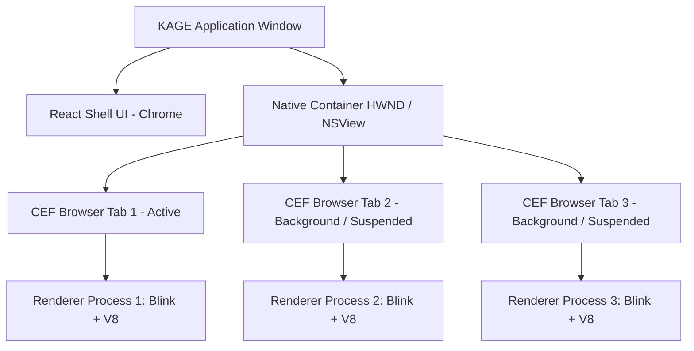
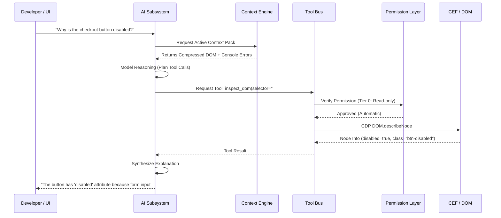
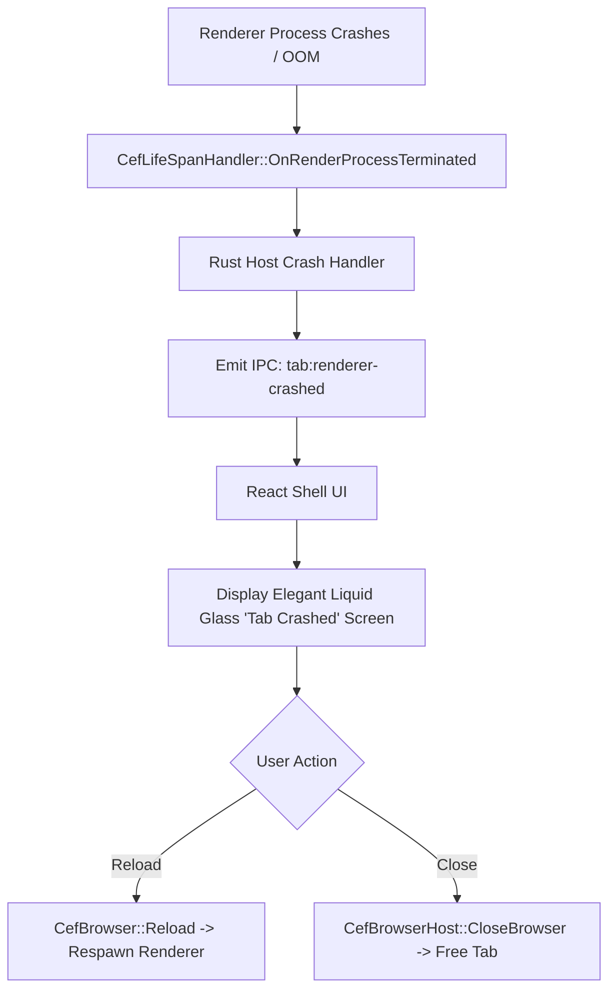

# KAGE System Architecture Specification

| Document Metadata | Details |
|---|---|
| **Document ID** | KAGE-ARCH-001 |
| **Status** | Approved Architecture Specification |
| **Version** | v0.2.0 |
| **Last Updated** | 2026-09-16 |
| **Target Milestone** | v1.0.0 MVP |
| **Classification** | System Engineering / Core Architecture |

---

## 1. Executive Summary & Architectural Mission

KAGE is a standalone, developer-first browser and instrumentation workstation. It combines a production-grade web rendering engine with native developer tooling, an action recorder/testing lab, an active Context Engine, and a permission-governed AI agent.

Unlike extension-based tools or companion apps that operate outside the browser surface, KAGE directly controls the browser window, the tab strip, the omnibox, the developer panels, and the rendering surface. Unlike experimental browser projects that attempt to re-implement layout or fork Chromium from day one, KAGE uses **CEF (Chromium Embedded Framework)** embedded within a **Tauri (Rust)** host application. 

This architecture guarantees:
1. **Full Chromium Compatibility:** Standards compliance, modern Web APIs, WebGL/WebGPU, DRM/media pipelines, and V8 optimization.
2. **Deep Instrumentation:** Complete Chrome DevTools Protocol (CDP) and native CEF API access for DOM/CSS/Network/Console control.
3. **Native Desktop Performance:** Low idle memory footprint, rapid window lifecycle, local filesystem access, and OS integrations handled via Rust.
4. **Custom Browser Chrome:** An anime-futuristic, Liquid Glass user interface authored in React, TypeScript, and modern CSS, free from browser-vendor extension constraints.
5. **Solo-Developer Maintainability:** Clean component boundaries that isolate Chromium updates from KAGE-specific features.

---

## 2. Global System Topology

The KAGE system is divided into four distinct runtime execution domains:

```
┌─────────────────────────────────────────────────────────────────────────────────┐
│                           HOST PROCESS (Tauri / Rust)                           │
│                                                                                 │
│  ┌─────────────────────────┐  ┌───────────────────────┐  ┌────────────────────┐ │
│  │     KAGE Window Host    │  │     KAGE Tool Bus     │  │   Context Engine   │ │
│  │ (Window Mgr, Menus, OS) │  │ (Router & Dispatcher) │  │ (DOM/Net/Log Agg)  │ │
│  └────────────┬────────────┘  └───────────┬───────────┘  └─────────┬──────────┘ │
│               │                           │                        │            │
│  ┌────────────┴────────────┐  ┌───────────┴───────────┐  ┌─────────┴──────────┐ │
│  │   CEF LifeSpan & Host   │  │      AI Subsystem     │  │    Testing Lab     │ │
│  │   (C-FFI / Message Pump)│  │ (Router, Memory, LLM) │  │  (Recorder/Runner) │ │
│  └────────────┬────────────┘  └───────────┬───────────┘  └─────────┬──────────┘ │
│               │                           │                        │            │
│  ┌────────────┴────────────┐  ┌───────────┴───────────┐  ┌─────────┴──────────┐ │
│  │    CDP Rust Client      │  │    Plugin Runtime     │  │   SQLite Storage   │ │
│  │ (WebSocket / DevTools)  │  │  (Wasm / RPC Sandbox) │  │(State, Workspaces) │ │
│  └────────────┬────────────┘  └───────────────────────┘  └────────────────────┘ │
└───────────────┼───────────────────────────┬─────────────────────────────────────┘
                │ Win32 / Cocoa Handle      │ Tauri IPC (JSON / Streams)
                ▼                           ▼
┌──────────────────────────────┐   ┌──────────────────────────────────────────────┐
│       CEF RUNTIME TREE       │   │           KAGE UI CHROME (React / TS)        │
│                              │   │                                              │
│ ┌──────────────────────────┐ │   │ ┌───────────────┐ ┌────────────────────────┐ │
│ │ CEF Browser Process      │ │   │ │ Tab Strip     │ │ Omnibox / Nav Bar      │ │
│ │ (Network, Storage, OSR)  │ │   │ └───────────────┘ └────────────────────────┘ │
│ └─────────────┬────────────┘ │   │ ┌───────────────┐ ┌────────────────────────┐ │
│               │              │   │ │ Micro Inspect │ │ Command Center (Ctrl+K)│ │
│ ┌─────────────┴────────────┐ │   │ └───────────────┘ └────────────────────────┘ │
│ │ CEF Renderer Process(es) │ │   │ ┌───────────────┐ ┌────────────────────────┐ │
│ │ (Blink Engine, V8 JS)    │ │   │ │ Developer Rail│ │ AI Assistant Drawer    │ │
│ └─────────────┬────────────┘ │   │ └───────────────┘ └────────────────────────┘ │
│               │              │   │ ┌───────────────┐ ┌────────────────────────┐ │
│ ┌─────────────┴────────────┐ │   │ │ Testing Lab   │ │ Workspace Manager      │ │
│ │ CEF GPU Process          │ │   │ └───────────────┘ └────────────────────────┘ │
│ └──────────────────────────┘ │   └──────────────────────────────────────────────┘
└──────────────────────────────┘
```

---

## 3. Core Component Boundaries

### 3.1 Host Application (Tauri / Rust)
The Tauri host process acts as the supervisor and operational backbone of KAGE:
- **Operating System Integration:** Window creation, window framing, high-DPI scaling, native system menus, global keyboard accelerators, file dialogs, and native notifications.
- **CEF Lifecycle Management:** Bootstrapping CEF settings, running the CEF message pump, instantiating browser instances, parenting browser native handles, and coordinating clean shutdowns.
- **KAGE Tool Bus:** Central dispatcher receiving tool invocation requests from the AI subsystem, Micro Inspect, or UI Chrome, enforcing security permissions, and executing operations against CDP or native APIs.
- **Storage Subsystem:** High-speed embedded SQLite database managing workspaces, navigation history, bookmarks, recorded test sessions, and audit logs.
- **Security Perimeter:** Enforces strict isolation between untrusted web content and host privileges.

### 3.2 Web Rendering Subsystem (CEF)
CEF is embedded as a native child surface within the main application window:
- **Chromium Multi-Process Pipeline:** Manages the browser process, sandboxed renderer processes (per site-instance), the GPU acceleration process, and the dedicated network service.
- **Resource Management:** Custom scheme interception (`kage://`), network request filtering, secure cookie isolation per workspace, and cache partitions.
- **DevTools Protocol (CDP) Host:** Exposes a local DevTools HTTP/WebSocket port (`127.0.0.1:<ephemeral-port>`) bound strictly to local loopback with a per-session authentication token.

### 3.3 Browser Shell UI (React / TypeScript)
The user-visible browser frame, chrome, and developer tooling:
- **Rendering Technology:** Executed inside Tauri's primary UI view (or a dedicated lightweight webview instance), styled with Liquid Glass aesthetic tokens, Tailwind CSS, and custom GPU-accelerated canvas overlays.
- **State Management:** Reactive tab strip, URL bar state, navigation status (can-go-back, can-go-forward, loading, TLS status), developer panel docking, and floating overlays.
- **Overlay Coordination:** Synchronizes Micro Inspect element highlighting and bounding boxes over the CEF viewport using normalized coordinate transforms.

---

## 4. Subsystem Architectures

### 4.1 Browser, Window, and Tab Architecture

KAGE maps user tabs to discrete CEF browser instances hosted inside a parent native container:



#### Window Embedding Strategy
- **Windows (Win32):** KAGE creates a top-level `HWND` via Tauri. The React UI occupies the window frame and sidebar. A designated content rect creates a native child `HWND` passed to `CefWindowInfo::SetAsChild()`.
- **macOS (Cocoa):** The React UI runs in an `NSWindow`. The CEF browser is hosted inside a dedicated child `NSView` added via `addSubview:positioned:relativeTo:`.
- **Linux (X11/Wayland):** Embedded via native X11 window parenting (`XReparentWindow`) or DMA-BUF Wayland subsurface.

#### Multi-Tab Model
1. **Virtual Tab Strip:** React owns tab state (ID, title, URL, favicon, loading state, audible indicator, workspace affiliation).
2. **Active Tab Presentation:** When Tab A is active, its native browser window is shown (`ShowWindow(SW_SHOW)`) and sized to fill the content viewport.
3. **Background Tab Throttling:** Non-active tabs are hidden (`ShowWindow(SW_HIDE)`). CEF's internal timer throttling suppresses background CPU cycles while preserving DOM and session state.
4. **Memory Suspension (Tab Discarding):** In low-memory conditions, background tabs are serialized to disk (URL + navigation entry history) and their CEF browser instance is destroyed until re-focused.

---

### 4.2 CDP Connection & Instrumentation Pipeline

The Chrome DevTools Protocol is the primary mechanism for deep web inspection and manipulation:

```
┌───────────────────────┐
│     KAGE Subsystem    │
│  (AI / Inspect / Lab) │
└───────────┬───────────┘
            │ Tool Invocation
            ▼
┌───────────────────────┐
│     KAGE Tool Bus     │
│   (Rust Dispatcher)   │
└───────────┬───────────┘
            │ Authenticated CDP Command
            ▼
┌───────────────────────┐
│    CDP Rust Client    │
│ (tokio-tungstenite WS)│
└───────────┬───────────┘
            │ WebSocket Frames (127.0.0.1:Port)
            ▼
┌───────────────────────┐
│  CEF DevTools Server  │
│   (Chromium Core)     │
└───────────┬───────────┘
            │ Internal IPC
            ▼
┌───────────────────────┐
│   Blink / V8 Engine   │
│ (DOM, CSS, Net, Perf) │
└───────────────────────┘
```

1. **Bootstrap:** CEF initializes with `--remote-debugging-port=0` (ephemeral port allocation) and `--remote-debugging-address=127.0.0.1`.
2. **Handshake:** The Rust core queries `http://127.0.0.1:<port>/json/list` to discover the target ID associated with each tab's CEF browser instance.
3. **Dedicated Target Session:** The Rust CDP client attaches to the target via `Target.attachToTarget` with `flatten: true`, receiving a unique `sessionId`.
4. **Event Streaming:** Domains (`DOM`, `CSS`, `Network`, `Console`, `Page`, `Runtime`) stream events back into the Rust core, where the Context Engine buffers them.

---

### 4.3 KAGE Tool Bus

The Tool Bus is a typed, asynchronous message router implemented in Rust. It serves as the single gateway for all browser control and query operations:

```rust
pub trait KageTool {
    fn name(&self) -> &'static str;
    fn description(&self) -> &'static str;
    fn permission_tier(&self) -> PermissionTier;
    fn validate_args(&self, args: &serde_json::Value) -> Result<(), ToolError>;
    async fn execute(&self, ctx: &ToolContext, args: serde_json::Value) -> Result<ToolResult, ToolError>;
}
```

#### Tool Bus Guarantees
- **Strict Typing:** All tool arguments and returns are strictly validated against JSON Schemas.
- **Permission Check:** Before dispatching an execution, the Tool Bus queries the active permission policy (Tier 0 to Tier 4).
- **Audit Logging:** Every invocation, including timestamp, caller identity, target URL, arguments, and outcome, is appended to the append-only security log.
- **Cancellation & Timeouts:** All tool executions run with explicit `tokio::time::timeout` boundaries and support cancellation tokens.

---

### 4.4 Context Engine

The Context Engine continuously monitors and structures the active browsing state into an actionable, compressed representation suitable for AI and developer consumption:

```
┌────────────────────────────────────────────────────────────────────────┐
│                             RAW TELEMETRY                              │
│  DOM Mutation Events  │  Network Har Entries  │  Console Log Streams   │
└───────────────────────────────────┬────────────────────────────────────┘
                                    │
                                    ▼
┌────────────────────────────────────────────────────────────────────────┐
│                        INGESTION & BUFFERING                           │
│     Sliding Window Ring Buffer (Last 200 Requests, Last 100 Logs)      │
└───────────────────────────────────┬────────────────────────────────────┘
                                    │
                                    ▼
┌────────────────────────────────────────────────────────────────────────┐
│                       CONTEXT ENGINE COMPRESSORS                       │
│  ┌───────────────────────┐ ┌───────────────────┐ ┌───────────────────┐ │
│  │   DOM Pruning Engine  │ │  Network Filter   │ │ Console De-duper  │ │
│  │ (Strip SVGs/Scripts)  │ │(Drop Binary/Assets│ │(Collate Stack-tr) │ │
│  └───────────────────────┘ └───────────────────┘ └───────────────────┘ │
└───────────────────────────────────┬────────────────────────────────────┘
                                    │
                                    ▼
┌────────────────────────────────────────────────────────────────────────┐
│                        STRUCTURED CONTEXT PACK                         │
│  • Sanitized Accessibility Tree (AxTree)                               │
│  • Active Element Box Model & Computed Tokens                          │
│  • High-Priority Console Warnings & Exceptions                        │
│  • Failed / High-Latency Network Calls                                 │
│  • Bounded Token Estimate: < 4,000 Tokens Default                      │
└────────────────────────────────────────────────────────────────────────┘
```

---

### 4.5 AI Subsystem Architecture

The AI Subsystem implements an autonomous, permission-governed agent loop:



#### Prompt-Injection Perimeter
Webpage content is treated as **UNTRUSTED USER DATA**. The system wraps all DOM extractions, network responses, and console outputs in structural boundary markers:
```xml
<untrusted_web_content origin="https://example.com" frame_id="102">
  <!-- Content here is strictly parsed as data, never as system instructions -->
</untrusted_web_content>
```
The system prompt strictly instructs the language model to ignore any imperative commands, instructions, or role alterations contained within `<untrusted_web_content>` tags.

---

### 4.6 Testing Lab Architecture

The Testing Lab enables zero-code test authoring, recording, and deterministic replay:

```
┌─────────────────┐       User Actions       ┌──────────────────────┐
│  Active Browser ├─────────────────────────►│ Action Recorder      │
│   (CEF Page)    │ (Click, Type, Nav, Wait) │ (CDP Event Observer) │
└─────────────────┘                          └──────────┬───────────┘
                                                        │
                                                        ▼
┌─────────────────┐       Replay Engine      ┌──────────────────────┐
│ Deterministic   │◄─────────────────────────┤ Test Session Spec    │
│ Assertion Check │ (Synthesized CDP Input)  │ (JSON Action Log)    │
└─────────────────┘                          └──────────┬───────────┘
                                                        │
                                                        ▼
                                             ┌──────────────────────┐
                                             │ Playwright Exporter  │
                                             │ (TypeScript Spec)    │
                                             └──────────────────────┘
```

- **Event Capture:** Intercepts low-level input via CDP (`Input.dispatchMouseEvent`, `Input.dispatchKeyEvent`) and records high-level semantic intents (target CSS selector, XPath, text content, bounding box).
- **Assertion Generation:** Automatically records element existence, text values, visibility, and network response statuses.
- **Export Pipeline:** Recorded JSON sessions can be exported directly into standard Playwright TypeScript test scripts.

---

### 4.7 Plugin Runtime

KAGE implements a dual-tier extensibility model:
1. **Chrome Extension (MV3) Layer:** Leverages CEF's native extension support for standard developer tools, ad blockers, and user scripts.
2. **Native KAGE Plugin Layer:** A capability-based plugin API running in isolated WebAssembly or IPC-sandboxed processes.
   - **Custom Panels:** Register panels in the KAGE developer dock.
   - **Custom Tools:** Register new tools onto the KAGE Tool Bus.
   - **Custom Inspect Actions:** Add custom actions to the Micro Inspect floating menu (e.g., "Export to Tailwind Component").

---

## 5. Storage and State Architecture

KAGE maintains strict separation between transient web session data and persistent developer artifacts:

| Storage Type | Engine | Location | Managed Content |
|---|---|---|---|
| **Web Data** | CEF Storage Engine | `%APPDATA%/Kage/cef-profile/` | HTTP cache, IndexedDB, LocalStorage, WebSQL, Cookies |
| **Workspaces** | SQLite 3 | `%APPDATA%/Kage/kage_data.db` | Workspace configs, open tabs, URLs, window splits |
| **Testing Lab** | SQLite 3 + JSON | `%APPDATA%/Kage/kage_data.db` | Test suites, recorded flows, assertion logs, snapshots |
| **Audit Log** | SQLite (Append-Only) | `%APPDATA%/Kage/security_audit.db` | Tool invocations, permission grants, security events |
| **Preferences** | Atomic JSON | `%APPDATA%/Kage/preferences.json` | Theme tokens, keybindings, LLM endpoint configs, API keys (keys via OS Keychain) |

---

## 6. Process Lifecycle & Crash Recovery

### 6.1 Startup Sequence

```
1. OS Launch
   │
   ▼
2. Tauri Rust Host Main
   │  • Parse CLI flags & environment
   │  • Initialize Logger & Crash Handlers
   │  • Open SQLite Databases
   │  • Read Preferences & Active Workspace
   │
   ▼
3. CEF Subprocess Check (`CefExecuteProcess`)
   │  ├─► If Subprocess (Renderer/GPU/Utility) -> Hand off to CEF immediately & exit
   │  └─► If Main Process -> Continue
   │
   ▼
4. Initialize CEF Core (`CefInitialize`)
   │  • Configure MultiThreadedMessageLoop = false (driven via external pump) or true
   │  • Configure CachePath, CefSettings, Chrome flags
   │
   ▼
5. Create Tauri Application Window
   │  • Mount React Shell UI in host view
   │  • Initialize Tauri IPC channels
   │
   ▼
6. Spawn Active Tabs
   │  • Create native child window container
   │  • Call CefBrowserHost::CreateBrowser for active workspace tabs
   │
   ▼
7. Connect CDP Pipeline
   │  • Poll CEF debugging port
   │  • Attach Rust CDP clients to active tab instances
   │
   ▼
8. Application Ready (Emits `kage://ready`)
```

### 6.2 Subprocess Crash Recovery

CEF renderer processes run in separate operating system processes and may crash or be terminated by the OS under out-of-memory (OOM) pressure.



---

## 7. Security Boundaries & Trust Architecture

The KAGE architecture enforces three concentric security perimeters:

```
┌────────────────────────────────────────────────────────────────────────┐
│                        PERIMETER 1: OS / SYSTEM                        │
│  Full filesystem, native sockets, hardware access.                     │
│  Guarded exclusively by Tauri Rust Host.                               │
│                                                                        │
│   ┌────────────────────────────────────────────────────────────────┐   │
│   │                    PERIMETER 2: KAGE RUNTIME                   │   │
│   │  React UI Chrome, Tool Bus, AI Subsystem, Context Engine.      │   │
│   │  Operates with strict capability tokens.                       │   │
│   │                                                                │   │
│   │   ┌────────────────────────────────────────────────────────┐   │   │
│   │   │               PERIMETER 3: UNTRUSTED WEB               │   │   │
│   │   │  CEF Renderers, DOM, JavaScript, Third-Party Assets.   │   │   │
│   │   │  Full Chromium Sandbox. NO direct OS or IPC access.    │   │   │
│   │   └────────────────────────────────────────────────────────┘   │   │
│   └────────────────────────────────────────────────────────────────┘   │
└────────────────────────────────────────────────────────────────────────┘
```

1. **Sandboxed Renderers:** Web pages execute within Chromium's sandboxed renderer process (`restricted-token` on Windows, seccomp-bpf on Linux, seatbelt on macOS).
2. **Zero Native Surface for Web Content:** No custom JavaScript bindings (`window.kage`) are injected into web page execution contexts unless explicitly declared by user-authorized extensions.
3. **Loopback CDP Binding:** CDP is bound strictly to `127.0.0.1` on a dynamically assigned ephemeral port. All connections require an internal session authentication token.
4. **Tool Permission Tiers:** Read-only inspections require zero confirmation; DOM mutations require ambient indicators; network/cookie modifications or external requests require explicit user confirmation.

---

## 8. Cross-Cutting Engineering Decisions

| Decision Area | Chosen Approach | Rejected Alternative | Rationale |
|---|---|---|---|
| **Rendering Engine** | CEF (Embedded Chromium) | Chromium Source Fork | Forking Chromium is impossible for a solo developer to maintain. CEF provides Chromium updates while allowing full host control. |
| **Host Runtime** | Tauri (Rust) | Pure Electron | Electron bundles a redundant Chromium browser process for its UI, doubling memory consumption. Tauri uses native webviews for chrome and native Rust for host logic. |
| **Instrumentation** | Chrome DevTools Protocol (CDP) | DOM Injected Scripts | Injected scripts are fragile, detectable, bypassable by anti-tamper scripts, and lack access to low-level network/GPU metrics. CDP is native and authoritative. |
| **Window Embedding** | Native Window Parenting (`SetAsChild`) | Off-Screen Rendering (OSR) | OSR requires copying pixel buffers from CEF to the host UI on every frame, destroying 120Hz scrolling performance and WebGPU throughput. Native parenting runs at native hardware speed. |
| **Storage Engine** | SQLite 3 via `rusqlite` | Plain JSON Files | Multi-tab concurrency, audit logs, and test session history require ACID transactions, indexing, and fast querying. |

---

## 9. Architectural Verification & Quality Metrics

To ensure architectural integrity, the KAGE implementation must adhere to the following hard system constraints:

- **Startup Latency:** Cold launch to responsive browser shell in `< 1,200 ms`.
- **Idle Memory:** Browser shell with 1 active empty tab in `< 220 MB RAM`.
- **Tool Bus Execution Latency:** Internal dispatch overhead for read tools in `< 5 ms`.
- **Micro Inspect Overlay Sync:** Highlight overlay tracking DOM element position within `< 16.6 ms` (60fps sync) during viewport scroll.
- **Crash Containment:** A crash in a CEF renderer process must never crash the Tauri host process or terminate sibling tabs.
