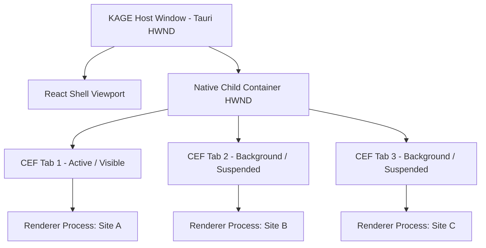
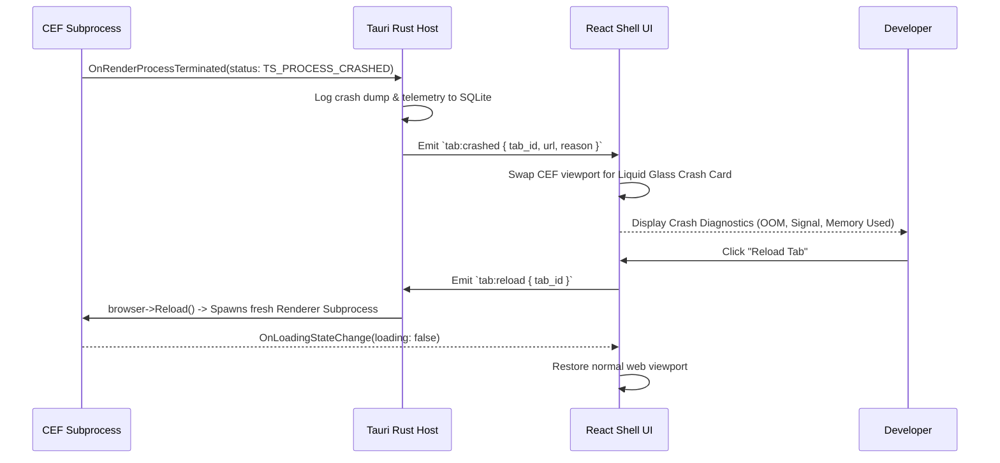

# KAGE Browser Shell Specification

| Document Metadata | Details |
|---|---|
| **Document ID** | KAGE-ARCH-006 |
| **Status** | Approved Core Specification |
| **Version** | v0.2.1 |
| **Last Updated** | 2026-09-16 |
| **Target Milestone** | v1.0.0 MVP |
| **Classification** | Browser Shell Architecture & Runtime Orchestration |

---

## 1. Executive Summary & Shell Mission

The **KAGE Browser Shell** is the application surface that turns an embedded web engine (CEF) and a native systems runtime (Tauri / Rust) into a cohesive, high-performance developer browser. 

Unlike consumer browsers designed for passive content consumption, the KAGE Browser Shell is an active developer workstation. It orchestrates tab lifecycles, navigation state, omnibox queries, window layouts, native keyboard routing, download streams, and process crashes while enforcing strict boundaries between the React/TypeScript UI chrome, the privileged Rust host, and the untrusted web rendering surface.

```
╔═════════════════════════════════════════════════════════════════════════════════════╗
║                            PRIME ARCHITECTURAL INVARIANT                            ║
║                                                                                     ║
║        AI NEVER GETS BROWSER AUTHORITY DIRECTLY. EVERY AI ACTION BECOMES            ║
║        A TYPED TOOL BUS REQUEST, AND THE TOOL BUS—NOT THE MODEL, PROMPT,            ║
║        PLUGIN, OR UI—OWNS VALIDATION, AUTHORIZATION, EXECUTION,                     ║
║        CANCELLATION, AND AUDITING.                                                  ║
╚═════════════════════════════════════════════════════════════════════════════════════╝
```

---

## 2. Shell Responsibility Demarcation

To prevent architectural overlap, responsibilities are partitioned across three tiers:

```
┌────────────────────────────────────────────────────────────────────────┐
│                        RESPONSIBILITY BOUNDARIES                       │
├───────────────────┬───────────────────┬────────────────────────────────┤
│  KAGE UI (REACT)  │  TAURI / RUST     │  CEF (CHROMIUM CORE)           │
├───────────────────┼───────────────────┼────────────────────────────────┤
│ • Tab Strip UI    │ • Native HWND     │ • Blink HTML/CSS Layout        │
│ • Tab Grouping    │   Window Manager  │ • V8 JavaScript Execution      │
│ • Omnibox Input   │ • Child HWND      │ • HTTP/3 & TLS Networking      │
│ • Navigation Bar  │   Parenting       │ • Chromium Cookie Jar          │
│ • Tool Rail       │ • Global Hotkeys  │ • Web Storage (IndexedDB/LS)   │
│ • AI Drawer Dock  │ • Tool Bus Router │ • GPU Hardware Rasterization   │
│ • Micro Inspect   │ • SQLite Database │ • Multi-Process Sandboxing     │
│   Card Popover    │ • Download Stream │ • DevTools Protocol (CDP)      │
│ • Liquid Glass    │   File Writers    │   Server Core                  │
│   Style Tokens    │ • Profile Storage │ • Compositor Scrolling         │
└───────────────────┴───────────────────┴────────────────────────────────┘
```

---

## 3. Window & Tab Lifecycle Architecture

KAGE manages a hybrid window topology where top-level windows host the React shell webview and native child containers host individual CEF browser instances.



### 3.1 Tab State Representation in Rust & React

A tab is represented identically across the Rust host and React shell via typed IPC state:

```rust
#[derive(Debug, Clone, Serialize, Deserialize)]
pub struct KageTab {
    pub id: String,                // Unique tab ULID (e.g. "tab_01J8Y4B8X7...")
    pub workspace_id: String,      // Associated developer workspace
    pub group_id: Option<String>,  // Optional tab group affiliation
    pub url: String,               // Active navigation URL
    pub title: String,             // Page title from <title>
    pub favicon_url: Option<String>,
    pub is_loading: bool,
    pub can_go_back: bool,
    pub can_go_forward: bool,
    pub is_pinned: bool,
    pub is_muted: bool,
    pub is_crashed: bool,
    pub cdp_session_id: String,    // Active CDP target session
    pub window_handle: usize,      // OS native HWND/NSView pointer
}
```

### 3.2 Tab Lifecycle Transitions

```
[ New Tab (Ctrl+T) ]
         │
         ▼
1. React Shell emits `tab:create { url, workspace_id }`
         │
         ▼
2. Rust Host allocates `tab_id`, creates CEF Browser via `CefBrowserHost::CreateBrowser`
         │
         ▼
3. CEF triggers `CefLifeSpanHandler::OnAfterCreated`
         │  • Rust registers child HWND into Container
         │  • Rust attaches CDP WebSocket Client
         ▼
4. Rust emits `tab:created { tab }` ➔ React updates Tab Strip
         │
         ▼
[ Tab Switching (User clicks tab or Ctrl+Tab) ]
         │
         ▼
5. React emits `tab:activate { tab_id }`
         │
         ▼
6. Rust executes atomic window visibility swap:
         │  • Previous active tab: `ShowWindow(hwnd, SW_HIDE)`
         │  • Target active tab: `SetWindowPos(hwnd, SWP_SHOWWINDOW)`
         ▼
7. Target tab CEF browser immediately receives paint focus
```

### 3.3 Background Tab Throttling & Discarding
- **Background Throttling:** Non-active tabs have their native window hidden (`SW_HIDE`). Chromium's background timer throttling automatically reduces JavaScript `setTimeout` execution to a 1-second cadence, preventing background tabs from consuming excessive CPU cycles.
- **Tab Discarding (Memory Pressure):** Under high RAM consumption, KAGE serializes background tabs to disk (URL, scroll position, and navigation history) and destroys their CEF browser instance. When the user selects the discarded tab, KAGE reinstantiates the browser and restores state seamlessly.

---

## 4. Tab Groups & Workspace Association

KAGE provides native tab grouping designed for developer workflows:

```
┌─────────────────────────────────────────────────────────────────────────┐
│ ▾ [● Client API (3)]  [GET /users ✕]  [POST /auth ✕]  [Docs ✕] │ [ + ]  │
├─────────────────────────────────────────────────────────────────────────┤
│ ▾ [● Frontend (2)]    [localhost:3000 ✕]  [Tailwind UI ✕]               │
└─────────────────────────────────────────────────────────────────────────┘
```

- **Color Token Anchors:** Tab groups are assigned visual color chips corresponding to KAGE palette tokens (Peach `#F9DBBD`, Blush `#FFA5AB`, Rose `#DA627D`, Crimson `#A53860`).
- **Collapsible Rails:** Clicking a tab group pill collapses its member tabs into a single compact chip, preserving viewport real estate during deep multi-tasking.
- **Workspace Scoping:** Tab groups belong to specific **Workspaces**. Switching workspaces automatically suspends the current workspace's tabs and restores the target workspace's tab layout from SQLite.

---

## 5. Omnibox & Navigation Engine

The Omnibox is KAGE's unified navigation and command input field. It combines standard web URL navigation with instant search, workspace navigation, and AI assistant actions.

```
┌─────────────────────────────────────────────────────────────────────────┐
│ 🔒 https://store.example.com/checkout                      [⚡ Ask AI] │
├─────────────────────────────────────────────────────────────────────────┤
│ 🔍 store.example.com/checkout — Active Tab                             │
│ 🌐 https://store.example.com/cart — History Match                       │
│ 🛠️  Tool: Run Micro Inspect on current page (Ctrl+Shift+C)               │
│ 🤖 AI: "Analyze network failures on this origin"                       │
│ 📑 Bookmark: Production API Reference (api.example.com/docs)            │
└─────────────────────────────────────────────────────────────────────────┘
```

### 5.1 Omnibox Input Parsing Rules
1. **Direct Scheme (`http://`, `https://`, `kage://`):** Interpreted immediately as a direct navigation.
2. **Local Development Hostnames (`localhost`, `127.0.0.1`, `*.local`, `*:[0-9]+`):** Interpreted as direct web navigation, defaulting to `http://`.
3. **Domain Pattern (`[a-z0-9-]+\.[a-z]{2,}`):** Interpreted as direct web navigation, defaulting to `https://`.
4. **Natural Language / Keyword:** Routes to the developer's configured search engine (DuckDuckGo, Google, Kagi) or opens the Command Center (`Ctrl+K`).

### 5.2 Navigation State Synchronization
The Omnibox reflects continuous navigation events emitted by CEF:
- `CefLoadHandler::OnLoadingStateChange`: Controls the spinner, stop button, and reload button.
- `CefDisplayHandler::OnAddressChange`: Updates the omnibox text when client-side Single-Page Apps (SPA) call `history.pushState`.
- `CefDisplayHandler::OnTitleChange`: Updates the title in the tab strip and history database.
- `CefDisplayHandler::OnFaviconURLChange`: Fetches and caches the page icon.

---

## 6. CEF Viewport Ownership & Coordinate Routing

> [!WARNING]
> **Native Surface Boundary:** CEF renders directly into its own OS window handle backed by its own DirectX/Metal swapchain. The React Shell Webview **does not receive web page DOM events directly**.

```
┌─────────────────────────────────────────────────────────────────────────┐
│ Tauri Application Window                                                │
│                                                                         │
│  ┌───────────────────────────────────────────────────────────────────┐  │
│  │ React Shell UI (Address Bar, Tab Bar, Tool Rail)                  │  │
│  │ (Captures native mouse & keyboard when cursor is over Chrome)     │  │
│  └───────────────────────────────────────────────────────────────────┘  │
│                                                                         │
│  ┌───────────────────────────────────────────────────────────────────┐  │
│  │ Native Child HWND (CEF Viewport)                                  │  │
│  │                                                                   │  │
│  │  • Captures clicks & keystrokes directly for Web Page             │  │
│  │  • Blink processes layout, scrolling, input text                  │  │
│  │  • GPU executes hardware rasterization                            │  │
│  └───────────────────────────────────────────────────────────────────┘  │
└─────────────────────────────────────────────────────────────────────────┘
```

### 6.1 Input Focus & Accelerator Routing
When the user types or presses keyboard shortcuts:
- **Global Accelerators (`Ctrl+T`, `Ctrl+W`, `Ctrl+K`, `Ctrl+Shift+C`):** Intercepted at the Tauri OS window level (`wry`/`tao`). The host processes the accelerator immediately regardless of whether CEF or React has input focus.
- **Webpage Keystrokes:** When the native CEF child window has focus, standard keys (`ArrowDown`, `Space`, alphanumeric typing) pass directly to Blink.
- **Omnibox Focus (`Ctrl+L` / `Alt+D`):** When triggered, Tauri explicitly calls `SetFocus(shell_webview_hwnd)` and emits an IPC message to auto-select all text in the React Omnibox input.

---

## 7. Download Management Subsystem

Downloads in KAGE are managed by the Rust host via `CefDownloadHandler`:

```
Web Page triggers file download
             │
             ▼
1. `CefDownloadHandler::OnBeforeDownload` triggered in Rust
             │
             ▼
2. Rust determines target file path (Default Downloads dir or Save As Dialog)
             │
             ▼
3. Rust emits `download:started { id, file_name, total_bytes }` ➔ React UI
             │
             ▼
4. `CefDownloadHandler::OnDownloadUpdated` streams progress (bytes_received, speed)
             │
             ▼
5. React Download Drawer displays live Liquid Glass progress bar
             │
             ▼
6. On completion: File scanned, native OS notification emitted, item saved to history
```

Developers can pause, resume, or cancel downloads directly from the Download Drawer using the KAGE Tool Bus.

---

## 8. Permissions & Device Access Governance

Web pages requesting access to sensitive capabilities (camera, microphone, geolocation, desktop capture, notifications) are intercepted by `CefPermissionHandler`:

```
┌─────────────────────────────────────────────────────────────┐
│ ✦ Permission Request                           [Origin: ...]│
├─────────────────────────────────────────────────────────────┤
│ "https://meet.example.com" wants to access:                 │
│  📹 Camera                                                  │
│  🎙️ Microphone                                              │
│                                                             │
│ [ Block Always ]  [ Allow for This Session ]  [ Allow ]     │
└─────────────────────────────────────────────────────────────┘
```

- **Zero Chromium Default Dialogs:** Native Chromium permission bubbles are suppressed. KAGE displays a styled Liquid Glass permission modal.
- **Granular Storage:** Permissions are persisted in SQLite partitioned strictly by `(workspace_id, origin)`.
- **Revocation:** Permissions can be reviewed and revoked at any time via the URL bar lock icon or Developer Settings.

---

## 9. Profile Storage & Isolation

KAGE supports isolated developer profiles:

| Profile Mode | Disk Storage Location | Cookie & Cache Behavior | Use Case |
|---|---|---|---|
| **Default Profile** | `%APPDATA%/Kage/cef-profile/` | Persistent cookies, cache, IndexedDB across restarts. | Daily developer browsing. |
| **Workspace Isolated**| `%APPDATA%/Kage/workspaces/<id>/` | Dedicated isolated cache path and cookie jar per workspace. | Client project separation, multi-tenant testing. |
| **Ephemeral / Incognito** | In-Memory (No disk storage) | Completely cleared upon tab/window closure. | Clean session testing, zero-cache reproduction. |

---

## 10. Crash Recovery & Resilience Architecture

If an untrusted webpage causes a renderer process crash (Blink segfault, V8 Out-of-Memory, or GPU driver reset):



- **Crash Containment:** A crash in a tab's renderer process **never terminates** the Tauri host process, the React shell UI, or sibling tabs.
- **Diagnostics Preservation:** Prior to reloading, KAGE saves the last 50 console logs and failed network requests from the Context Engine to assist debugging.
