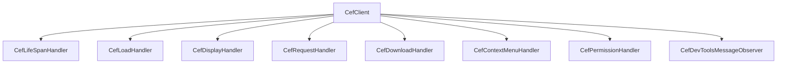

# KAGE CEF Integration Specification

| Document Metadata | Details |
|---|---|
| **Document ID** | KAGE-ARCH-002 |
| **Status** | Approved Integration Specification |
| **Version** | v0.2.0 |
| **Last Updated** | 2026-09-16 |
| **Target Milestone** | v1.0.0 MVP |
| **Classification** | Engine Embedding / Core Subsystem |

---

## 1. Scope and Mission

This document defines the technical integration specification for embedding the **Chromium Embedded Framework (CEF)** inside the KAGE browser. CEF acts as KAGE's core web runtime, handling DOM layout, CSS rendering, JavaScript execution via V8, GPU-accelerated compositing, and HTTP/3 networking.

KAGE wraps CEF inside a native **Tauri (Rust)** host application, establishing a clean boundary between Chromium's multi-process browser engine and KAGE's native developer tools, AI agent loop, and React-based shell.

```
Tauri
  │
  ├── Rust Core (Host Controller, Tool Bus, Storage)
  │
  ├── KAGE UI (React / TypeScript Shell)
  │
  └── CEF Host
        │
        ├── Browser Process (Resource routing, window host, DevTools server)
        ├── Renderer Process(es) (Blink engine, V8 execution per tab/origin)
        ├── GPU Process (DirectX/Vulkan hardware rasterization)
        └── Network Service (HTTP/3, cache, TLS, WebSocket engine)
```

---

## 2. CEF Version Strategy & Release Tracking

Chromium releases a major milestone every 4 weeks. Maintaining alignment without breaking KAGE developer features requires a structured versioning strategy:

1. **Upstream Channel:** KAGE pins to **CEF Stable Channels** based on Chromium Extended Stable or Stable milestones.
2. **Version Cadence:** CEF upgrades are pulled on an **8-to-12 week cadence** (every two Chromium major versions) to ensure test stability, unless an active zero-day security vulnerability requires an out-of-band update.
3. **Binary Packaging:** KAGE consumes pre-compiled CEF binary distributions (`cef_binary_<version>_<platform>`) packaged with symbols for release and debug configurations.
4. **ABI Stability:** Integration code interfaces with CEF strictly via the standard C/C++ CEF API (`libcef_dll_wrapper`), isolated behind a Rust FFI wrapper crate (`kage-cef-sys` / `kage-cef`).

---

## 3. Subprocess Architecture & Executable Topology

Chromium's process isolation model requires dedicated subprocesses for renderers, GPU acceleration, and utility tasks. KAGE uses a **two-executable architecture**:

```
Install Directory /
├── kage.exe                    <-- Primary Host Process (Tauri Rust + CEF Browser)
├── kage-cef-subprocess.exe     <-- Chromium Helper Subprocess (Renderer, GPU, Utility)
├── libcef.dll                  <-- CEF Shared Library
├── icudtl.dat                  <-- Unicode Data
├── snapshot_blob.bin           <-- V8 Snapshot
├── v8_context_snapshot.bin     <-- V8 Context
└── locales/                    <-- Localization Packs (.pak)
```

### 3.1 Helper Executable (`kage-cef-subprocess`)
On Windows and Linux, running helper tasks via a lightweight secondary executable minimizes startup overhead and prevents duplicate Tauri initialization:

```cpp
// kage-cef-subprocess.cpp
#include "include/cef_app.h"

int main(int argc, char* argv[]) {
    CefMainArgs main_args(argc, argv);
    // Execute subprocess logic (renderer, gpu-process, utility)
    return CefExecuteProcess(main_args, nullptr, nullptr);
}
```

On macOS, CEF requires dedicated helper app bundles (`KAGE Helper.app`, `KAGE Helper (Renderer).app`, `KAGE Helper (GPU).app`) to satisfy Apple sandbox and code-signing entitlements.

---

## 4. CEF Initialization & Bootstrap Pipeline

CEF initialization must occur on the primary OS thread before any native windows are constructed:

```rust
// Rust Host Boot Sequence
pub fn init_cef_subsystem() -> Result<CefContext, CefInitError> {
    let mut settings = CefSettings::default();
    
    // 1. Configure Subprocess Path
    let subprocess_path = get_helper_executable_path();
    settings.browser_subprocess_path = CefString::from(subprocess_path);
    
    // 2. Profile & Cache Paths
    let cache_dir = get_user_data_dir().join("cef-cache");
    settings.cache_path = CefString::from(cache_dir);
    settings.root_cache_path = CefString::from(get_user_data_dir());
    
    // 3. Security & Features
    settings.persist_session_cookies = true;
    settings.persist_user_preferences = true;
    settings.remote_debugging_port = 0; // Ephemeral loopback port
    
    // 4. Threading Architecture
    #[cfg(target_os = "windows")]
    {
        // On Windows, CEF can drive its own background UI thread
        settings.multi_threaded_message_loop = true;
    }
    #[cfg(not(target_os = "windows"))]
    {
        // On macOS/Linux, drive via external message pump on main run loop
        settings.multi_threaded_message_loop = false;
    }

    let main_args = CefMainArgs::new();
    let app = KageCefApp::new();
    
    let success = unsafe { CefInitialize(&main_args, &settings, app.into_raw(), std::ptr::null_mut()) };
    if !success {
        return Err(CefInitError::InitializationFailed);
    }

    Ok(CefContext { /* ... */ })
}
```

---

## 5. Browser Creation & Window Embedding

KAGE embeds CEF as a **windowed native child surface** inside the Tauri window. This provides full GPU hardware acceleration, sub-millisecond scrolling latency, and zero-copy rendering.

```
┌─────────────────────────────────────────────────────────────┐
│ Tauri Main Window (HWND: 0x001A02B4)                        │
│                                                             │
│ ┌─────────────────────────────────────────────────────────┐ │
│ │ KAGE React Shell UI (Address bar, Tab strip, Sidebars)  │ │
│ └─────────────────────────────────────────────────────────┘ │
│                                                             │
│ ┌─────────────────────────────────────────────────────────┐ │
│ │ Container HWND (HWND: 0x001A02F0)                       │ │
│ │                                                         │ │
│ │  ┌───────────────────────────────────────────────────┐  │ │
│ │  │ CEF Browser Window (HWND: 0x001A0318)             │  │ │
│ │  │ (Child of Container HWND via CefWindowInfo)       │  │ │
│ │  │                                                   │  │ │
│ │  │  [ Rendered Webpage Surface: Blink + V8 + GPU ]   │  │ │
│ │  └───────────────────────────────────────────────────┘  │ │
│ └─────────────────────────────────────────────────────────┘ │
└─────────────────────────────────────────────────────────────┘
```

### 5.1 Window Parent Configuration
```cpp
CefWindowInfo window_info;
RECT rect = { content_x, content_y, content_x + width, content_y + height };

#if defined(OS_WIN)
    window_info.SetAsChild(parent_container_hwnd, rect);
#elif defined(OS_MAC)
    window_info.SetAsChild(parent_container_nsview, rect);
#elif defined(OS_LINUX)
    window_info.SetAsChild(parent_container_x11_window, rect);
#endif

CefBrowserSettings browser_settings;
browser_settings.webgl = STATE_ENABLED;
browser_settings.javascript = STATE_ENABLED;
browser_settings.local_storage = STATE_ENABLED;

CefBrowserHost::CreateBrowser(
    window_info,
    kage_client_handler,
    CefString(initial_url),
    browser_settings,
    nullptr, // extra info dictionary
    request_context // custom isolated request context
);
```

### 5.2 Resize & Coordinate Synchronization
When the Tauri shell changes size or toggles sidebars, the container bounds change:
1. React shell calculates the content area rectangle in physical device pixels.
2. React emits a resize command over Tauri IPC: `shell:resize_viewport { x, y, width, height }`.
3. Rust host updates the child window position via native OS APIs (`SetWindowPos` on Win32, `setFrame:` on macOS).
4. CEF receives the native resize event and automatically updates Blink's viewport and compositor resolution.

---

## 6. Client Handlers & Lifecycle Hooks

KAGE customizes browser behavior by implementing CEF handler interfaces:



### 6.1 `CefLifeSpanHandler` (Tab Lifecycle)
- **`OnAfterCreated(CefRefPtr<CefBrowser> browser)`**: Registers the newly spawned browser instance with KAGE's Tab Registry in Rust. Generates a unique `kage_tab_id` and attaches DevTools listeners.
- **`DoClose(CefRefPtr<CefBrowser> browser)`**: Intercepts close requests. Returns `false` to allow default closing, or saves dirty form state before closing.
- **`OnBeforeClose(CefRefPtr<CefBrowser> browser)`**: Cleans up Rust-side data structures, closes CDP WebSocket sessions, and frees associated tab memory.

### 6.2 `CefLoadHandler` & `CefDisplayHandler` (Navigation State)
- **`OnLoadingStateChange`**: Emits loading status (`is_loading`, `can_go_back`, `can_go_forward`) to the React tab bar and address bar.
- **`OnAddressChange`**: Updates the omnibox URL when the user clicks a link or client-side routing occurs.
- **`OnTitleChange`**: Updates the tab title in the React tab strip.
- **`OnFaviconURLChange`**: Fetches and caches the site favicon for display in the tab and bookmark systems.

### 6.3 `CefRequestHandler` & Custom Schemes
- **Custom Scheme (`kage://`)**: Registered at startup to serve internal KAGE UI assets, documentation, and the New Tab Page from memory or bundled static assets.
- **Request Interception (`CefResourceRequestHandler`)**: Enables KAGE's Network Inspector to observe HTTP/HTTPS headers, bodies, timing, and cookies before transmission.
- **Certificate Verification (`OnCertificateError`)**: Handles self-signed certificates in local development environments (`localhost`, `127.0.0.1`) by presenting developer-friendly bypass dialogs.

### 6.4 `CefDownloadHandler`
- Intercepts browser file downloads.
- Routes download notifications through KAGE's native notification system and download drawer.
- Provides pause, resume, and cancel capabilities backed by native filesystem streams.

### 6.5 `CefPermissionHandler`
- Intercepts requests for camera, microphone, geolocation, and desktop capture.
- Prompts the user via KAGE's Liquid Glass permission modal rather than Chromium's default dialogs.

---

## 7. DevTools Protocol (CDP) & Internal Diagnostics

KAGE uses the **Chrome DevTools Protocol (CDP)** as its core instrumentation backbone.

```
┌────────────────────────────────────────────────────────┐
│               KAGE Host (Tauri / Rust)                 │
│                                                        │
│  ┌───────────────────────┐   ┌───────────────────────┐ │
│  │   Micro Inspect Host  │   │  Testing Lab Recorder │ │
│  └───────────┬───────────┘   └───────────┬───────────┘ │
│              │                           │             │
│              ▼                           ▼             │
│  ┌───────────────────────────────────────────────────┐ │
│  │               Rust CDP Dispatcher                 │ │
│  └───────────────────────────┬───────────────────────┘ │
└──────────────────────────────┼─────────────────────────┘
                               │ WebSocket Client (Loopback)
                               ▼
┌────────────────────────────────────────────────────────┐
│             CEF Embedded DevTools Server               │
│                                                        │
│  • Endpoint: ws://127.0.0.1:<ephemeral-port>/devtools/ │
│  • Domains: DOM, CSS, Network, Console, Page, Runtime  │
└────────────────────────────────────────────────────────┘
```

### 7.1 CDP Connection Mechanics
1. CEF is initialized with `remote_debugging_port = 0`.
2. On `OnAfterCreated`, KAGE queries CEF's active debugging port via `CefGetGlobalRequestContext()->GetDevToolsURL()`.
3. Rust establishes a dedicated loopback WebSocket client connection using `tokio-tungstenite`.
4. Commands are sent with monotonic IDs; incoming domain events (`Network.responseReceived`, `Console.messageAdded`, `DOM.attributeModified`) are dispatched to active subscribers.

### 7.2 Native DevTools Observer Fallback
In addition to loopback WebSockets, CEF provides `CefBrowserHost::AddDevToolsMessageObserver`. KAGE uses this internal C++ observer for low-latency memory profiling and heap snapshots, bypassing TCP loopback serialization overhead.

---

## 8. Threading Model & Synchronization Rules

CEF operates with strict thread-affinity rules. Violating these rules results in assertions or fatal process aborts.

| Thread | Responsible Subsystem | Permitted Operations |
|---|---|---|
| **Tauri Main Thread** | OS RunLoop, Window Events | OS windowing, menu dispatch, Tauri event pump. |
| **CEF UI Thread** | `TID_UI` | Browser creation, navigation calls, DevTools commands, DOM queries. |
| **CEF IO Thread** | `TID_IO` | Network request handling, IPC message routing, socket operations. |
| **CEF FILE Thread** | `TID_FILE_USER_BLOCKING` | Cache read/write, cookie persistence, SQLite profile storage. |
| **Rust Worker Pool** | `tokio::runtime` | AI agent loop, Tool Bus routing, SQLite queries, context compression. |

### Golden Rules of KAGE Threading:
1. **Never block `TID_UI`:** Heavy calculations, AI completions, or disk I/O must never run on CEF's UI thread.
2. **Cross-Thread Dispatch:** When a Rust background thread needs to command CEF, it must dispatch via `CefPostTask(TID_UI, task)`.
3. **Re-Entrancy Avoidance:** Never synchronously wait on a Rust `tokio::oneshot` receiver while inside a CEF callback.
4. **Live HWND Message Pump Owner (ARCH-CEF-THREAD-001):** Every native Win32 `HWND` participating in the CEF hierarchy must have an active message pump on its owning thread (`GetMessage` / `PeekMessage` / `DispatchMessage`). Win32 delivers child creation and destruction notifications (`WM_PARENTNOTIFY`, `WM_NCCREATE`) to the owning thread; without message dispatching, browser creation stalls and `cef::shutdown()` deadlocks.
5. **Execution vs Completion Semantics:** `CefUiExecutor::execute` confirms only that an operation was accepted/dispatched on `TID_UI`. Async CEF operations (such as `CreateBrowser`) complete only when their corresponding event callback (e.g. `OnAfterCreated`) fires and is processed by `BrowserEventBus`.

---

## 9. Process Termination & Crash Recovery

### 9.1 Graceful Shutdown Protocol
To prevent profile lock contention, corrupted cache files, and orphaned renderers, KAGE follows a strict 5-stage shutdown protocol:

```
User Closes Window / App Exit
       │
       ▼
1. Cancel Active Downloads & Close WebSocket Sessions
       │
       ▼
2. Call CefBrowserHost::CloseBrowser(true) on all active tabs
       │
       ▼
3. Await OnBeforeClose callback for each browser instance
       │
       ▼
4. Call CefShutdown() on main thread to flush cache and stop helper processes
       │
       ▼
5. Terminate Tauri Host Process
```

### 9.2 Renderer Crash & Hang Handling
If a tab crashes (segfault in Blink, V8 Out-Of-Memory, or OS termination):
1. `CefLifeSpanHandler::OnRenderProcessTerminated(browser, status)` is triggered with status codes (`TS_ABNORMAL_TERMINATION`, `TS_PROCESS_WAS_KILLED`, `TS_PROCESS_CRASHED`, `TS_PROCESS_OOM`).
2. KAGE's Rust host logs the crash telemetry, including URL and memory metrics.
3. An event `tab:crashed { tab_id, reason }` is emitted to the React UI.
4. The React tab displays an elegant Liquid Glass recovery card offering:
   - **Reload Page** (`browser->Reload()`)
   - **Open in Testing Lab** (inspect DOM state prior to crash)
   - **Close Tab**

---

## 10. Multi-Profile & Workspace Isolation

KAGE supports developer workspaces that isolate cookies, storage, and authentication states:

```cpp
// Isolated Request Context Creation per Workspace
CefRequestContextSettings context_settings;
CefString(&context_settings.cache_path).FromString(workspace_cache_path);
context_settings.persist_session_cookies = true;

CefRefPtr<CefRequestContext> workspace_context = 
    CefRequestContext::CreateContext(context_settings, new KageRequestContextHandler());
```

- **Default Workspace:** Shared standard cache and cookie jar.
- **Isolated Workspaces:** Each workspace (e.g., "Client A", "Staging QA") receives an isolated `CefRequestContext`. Storage, cookies, cache, and service workers are completely physically segregated on disk.
- **Incognito Tabs:** Ephemeral `CefRequestContext` with empty `cache_path` (in-memory storage only).

---

## 11. Build System & Binary Packaging

Integrating CEF requires handling substantial binary payloads:

### 11.1 Artifact Distribution Structure
- `libcef.dll` / `libcef.so` / `Chromium Embedded Framework.framework`: ~140 MB uncompressed.
- Asset files: `icudtl.dat`, `resources.pak`, `chrome_100_percent.pak`, `chrome_200_percent.pak`, `v8_context_snapshot.bin`.

### 11.2 Build Process Integration
1. **Fetch Step:** CI script downloads the pinned CEF binary distribution archive from CEF Spotify CDN or custom mirror.
2. **Compile Wrapper:** `libcef_dll_wrapper` is compiled via CMake with C++17.
3. **Link Step:** Rust host links against `cef_dll_wrapper` and `libcef` import libraries via `build.rs`.
4. **Bundle Step:** Tauri bundler copies CEF runtime assets and helper binaries into the application target directory (`target/release/`).
