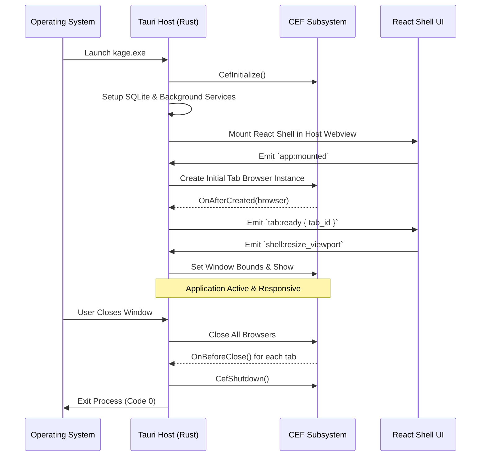

# KAGE Custom Tauri Specification

| Document Metadata | Details |
|---|---|
| **Document ID** | KAGE-ARCH-003 |
| **Status** | Approved Architecture Specification |
| **Version** | v0.2.0 |
| **Last Updated** | 2026-09-16 |
| **Target Milestone** | v1.0.0 MVP |
| **Classification** | Host Platform / System Architecture |

---

## 1. Architectural Purpose & Responsibility Demarcation

KAGE is not a standard Tauri application. In a standard Tauri app, Tauri's bundled OS webview (WebView2 on Windows, WebKit on macOS, WebKitGTK on Linux) renders the entire application, including any embedded web content.

In KAGE, **Tauri's role is strictly partitioned**. Tauri provides the native host platform, operating system integrations, local storage, secure IPC, and native background services, while **CEF** acts as the dedicated web rendering engine, and **React/TypeScript** renders the browser shell and developer UI.

This clear separation prevents Tauri and CEF from competing over window events, rendering cycles, or web runtime capabilities.

```
┌────────────────────────────────────────────────────────────────────────┐
│                        RESPONSIBILITY BREAKDOWN                        │
├───────────────────┬───────────────────┬────────────────────────────────┤
│  TAURI (RUST)     │    CEF (CHROMIUM) │   KAGE UI (REACT / TS)         │
├───────────────────┼───────────────────┼────────────────────────────────┤
│ • Window Framing  │ • Web Rendering   │ • Browser Chrome (Tabs, URL)   │
│ • OS Integration  │ • Blink Layout    │ • Micro Inspect Overlays       │
│ • File System     │ • V8 JS Engine    │ • Developer Rail Navigation    │
│ • Native Menus    │ • HTTP/3 Network  │ • Command Center (Ctrl+K)      │
│ • Global Hotkeys  │ • Web Storage     │ • AI Assistant Drawer          │
│ • Notifications   │ • Web Security    │ • Testing Lab Suite UI         │
│ • Secure IPC      │ • Web APIs (WebGL)│ • Workspace Switcher           │
│ • SQLite Database │ • Multi-process   │ • Liquid Glass Design Tokens   │
│ • Native Services │   Renderers/GPU   │ • Settings & Preferences UI    │
└───────────────────┴───────────────────┴────────────────────────────────┘
```

---

## 2. Window Layout & Native Surface Coexistence

KAGE uses a **hybrid window hosting model**. The top-level window is managed by Tauri (via `tao`/`wry`), while the rendered web surface is a native child window managed by CEF:

```
┌─────────────────────────────────────────────────────────────────────┐
│ Tauri Application Window (Top-Level HWND / NSWindow)                │
│                                                                     │
│ ┌─────────────────────────────────────────────────────────────────┐ │
│ │ Tab Strip & Window Controls (Tauri Webview - React UI)          │ │
│ ├─────────────────────────────────────────────────────────────────┤ │
│ │ Navigation Bar & Omnibox (Tauri Webview - React UI)             │ │
│ ├──────────────┬────────────────────────────────────┬─────────────┤ │
│ │ Tool Rail    │ Native CEF Surface                 │ AI Drawer   │ │
│ │ (React UI)   │ (Native Child HWND / NSView)       │ (React UI)  │ │
│ │              │                                    │             │ │
│ │ [Inspect]    │  • Blink HTML / CSS Rendering      │ [Chat]      │ │
│ │ [Console]    │  • V8 JavaScript Execution         │ [Context]   │ │
│ │ [Network]    │  • Direct Hardware GPU Compositing │ [Actions]   │ │
│ │ [Tests]      │                                    │             │ │
│ ├──────────────┴────────────────────────────────────┴─────────────┤ │
│ │ Status Bar & Performance Indicator (Tauri Webview - React UI)   │ │
│ └─────────────────────────────────────────────────────────────────┘ │
└─────────────────────────────────────────────────────────────────────┘
```

### 2.1 Native Child Window Attachment
- The React shell designates a `<div>` container with an ID of `#cef-viewport`.
- On mount, React measures `#cef-viewport` via a `ResizeObserver` and emits its physical bounds `(x, y, width, height)` to Tauri over IPC.
- Tauri's Rust core retrieves the top-level OS window handle (`HWND` on Windows, `NSView*` on macOS, `Window` on X11).
- Tauri instructs CEF to instantiate or reparent the active browser's native window inside the top-level window coordinates.
- CEF renders directly to its child window with full GPU hardware acceleration, bypassing any HTML canvas or webview overhead.

---

## 3. High-DPI Scaling & Coordinate Synchronization

When high-DPI displays (125%, 150%, 200%) or multi-monitor setups with disparate scale factors are used, coordinate misalignment can cause visual clipping or inaccurate click-targeting.

### 3.1 DPI Normalization Pipeline
1. **Tauri Scale Factor Detection:** Tauri listens for `WindowEvent::ScaleFactorChanged` and passes the new scale factor to the Rust coordinator.
2. **React Shell Bounds:** React computes logical pixel coordinates for the viewport rect and multiplies by `window.devicePixelRatio`:
   $$\text{Physical\_X} = \text{Logical\_X} \times \text{ScaleFactor}$$
   $$\text{Physical\_Y} = \text{Logical\_Y} \times \text{ScaleFactor}$$
3. **Atomic Win32 `SetWindowPos`:** Rust applies the physical bounding rect to the CEF child handle using `SWP_NOZORDER | SWP_NOACTIVATE`.
4. **CEF Viewport Sync:** CEF receives the resize message and notifies Blink's compositor to adjust the render target resolution synchronously.

---

## 4. Tauri Command Layer (`#[tauri::command]`)

All interactions between the React shell and the Rust backend are handled through strictly typed Tauri commands. Commands are grouped into functional modules:

```rust
// Window & Viewport Management
#[tauri::command]
pub async fn resize_cef_viewport(
    app: tauri::AppHandle,
    state: tauri::State<'_, KageState>,
    bounds: ViewportBounds,
) -> Result<(), KageError> {
    state.cef_manager.set_bounds(bounds).await?;
    Ok(())
}

// Tab Operations
#[tauri::command]
pub async fn create_tab(
    state: tauri::State<'_, KageState>,
    url: String,
    workspace_id: String,
) -> Result<TabInfo, KageError> {
    let tab = state.tab_manager.create_tab(&url, &workspace_id).await?;
    Ok(tab)
}

#[tauri::command]
pub async fn switch_tab(
    state: tauri::State<'_, KageState>,
    tab_id: String,
) -> Result<(), KageError> {
    state.tab_manager.activate_tab(&tab_id).await?;
    Ok(())
}

// Tool Bus Dispatcher
#[tauri::command]
pub async fn execute_tool(
    state: tauri::State<'_, KageState>,
    tool_name: String,
    args: serde_json::Value,
) -> Result<ToolResult, KageError> {
    let result = state.tool_bus.dispatch(&tool_name, args).await?;
    Ok(result)
}
```

---

## 5. Streaming Event Pipeline (Tauri Channels)

Certain operations produce streaming or high-frequency telemetry that would overload standard request-response IPC:
- **AI Token Streaming:** LLM completions streamed token-by-token to the AI Assistant drawer.
- **CDP Telemetry:** Network requests, console logs, and DOM mutation events streamed to DevTools panels.
- **Testing Lab Recorder:** Live action events streamed from the browser into the test authoring panel.

### 5.1 Tauri Channel Implementation
KAGE uses Tauri's `Channel` primitive for bi-directional, backpressure-aware streaming:

```rust
#[tauri::command]
pub async fn stream_ai_prompt(
    state: tauri::State<'_, KageState>,
    prompt: String,
    channel: tauri::ipc::Channel<AiStreamChunk>,
) -> Result<(), KageError> {
    let mut stream = state.ai_subsystem.execute_agent_loop(&prompt).await?;
    
    while let Some(chunk) = stream.next().await {
        channel.send(chunk)?;
    }
    
    Ok(())
}
```

On the frontend, React consumes the stream via an asynchronous iterator:

```typescript
import { Channel, invoke } from '@tauri-apps/api/core';

const channel = new Channel<AiStreamChunk>();
channel.onmessage = (chunk) => {
  if (chunk.type === 'token') {
    appendAiMessage(chunk.content);
  } else if (chunk.type === 'tool_call') {
    showToolExecutionIndicator(chunk.tool_name);
  }
};

await invoke('stream_ai_prompt', { prompt: userMessage, channel });
```

---

## 6. Application Lifecycle & Event Loop Integration

Coordinating Tauri's event loop with CEF's internal threading requires careful lifecycle hooks:



### 6.1 Multi-Threaded Loop vs External Pump
- **Windows:** CEF runs with `multi_threaded_message_loop = true`. CEF creates its own internal UI message pump thread (`CefUIThread`). Tauri runs its standard `wry`/`tao` message loop on the OS main thread. Inter-thread messages are marshaled safely via `CefPostTask`.
- **macOS:** CEF requires integration with the main Cocoa `NSApplication` run loop (`multi_threaded_message_loop = false`). Tauri schedules `CefDoMessageLoopWork()` via a high-resolution timer timer on the main thread loop (e.g., 60–120Hz).

---

## 7. Native OS Integrations

Tauri provides the native OS capabilities that web applications cannot access:

### 7.1 Native Menus & Global Keyboard Accelerators
- **Application Menu:** Native OS menus for File, Edit, View, Developer, Tools, Window, Help.
- **Global Accelerators:**
  - `Ctrl+K` / `Cmd+K`: Open Command Center
  - `Ctrl+Shift+I` / `Cmd+Option+I`: Toggle KAGE Developer Dock
  - `Ctrl+Shift+C` / `Cmd+Shift+C`: Toggle Micro Inspect Mode
  - `Ctrl+T` / `Cmd+T`: New Tab
  - `Ctrl+W` / `Cmd+W`: Close Active Tab
  - `Ctrl+Tab`: Next Tab / Tab Switcher

### 7.2 Native File System Access
- **Test Session Export:** Writing Playwright `.spec.ts` files directly to user project folders via native save dialogs (`tauri::dialog::FileDialogBuilder`).
- **HAR Export:** Saving full network traces to disk.
- **Screenshot Capture:** Saving element or full-page PNG/WebP captures to user-selected locations.

### 7.3 System Notifications
- Displaying test run completion, long-running AI task results, or download completions using the OS native notification daemon (`tauri-plugin-notification`).

---

## 8. Security Isolation in Tauri

KAGE configures Tauri's security sandbox to the highest standards:
1. **Strict Content Security Policy (CSP):** The React shell is served from a custom protocol (`kage://localhost`) with a strict CSP that prohibits `unsafe-eval` and remote script execution.
2. **IPC Scope Isolation:** Untrusted web pages rendered inside CEF have **zero access** to Tauri's IPC bridge (`window.__TAURI__`). The bridge is exclusively bound to the internal React shell.
3. **Rust Argument Validation:** All command inputs are deserialized into strongly-typed Rust structs and validated using the `validator` crate before execution.
