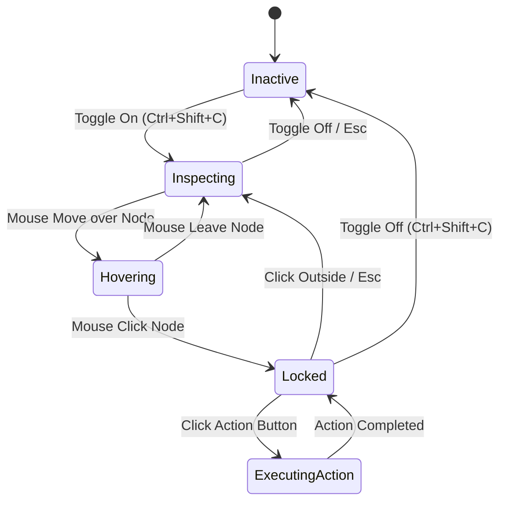

# KAGE Micro Inspect Specification

| Document Metadata | Details |
|---|---|
| **Document ID** | KAGE-CORE-001 |
| **Status** | Approved Core Specification |
| **Version** | v0.2.1 |
| **Last Updated** | 2026-09-16 |
| **Target Milestone** | v1.0.0 MVP |
| **Classification** | Developer Tooling / Core Differentiator |

---

## 1. Executive Summary & Product Mission

Standard browser developer tools require opening an intrusive, multi-megabyte DevTools drawer that consumes 40–50% of the screen, navigates a deeply nested DOM tree, and forces developers to decipher hundreds of inherited CSS rules.

```
╔═════════════════════════════════════════════════════════════════════════════════════╗
║                            PRIME ARCHITECTURAL INVARIANT                            ║
║                                                                                     ║
║        AI NEVER GETS BROWSER AUTHORITY DIRECTLY. EVERY AI ACTION BECOMES            ║
║        A TYPED TOOL BUS REQUEST, AND THE TOOL BUS—NOT THE MODEL, PROMPT,            ║
║        PLUGIN, OR UI—OWNS VALIDATION, AUTHORIZATION, EXECUTION,                     ║
║        CANCELLATION, AND AUDITING.                                                  ║
╚═════════════════════════════════════════════════════════════════════════════════════╝
```

**Micro Inspect** is KAGE’s flagship developer differentiator. It provides an instant, ambient, high-precision inspection experience directly over the rendered web page. Without docking a heavy panel, developers can hover over any element to see its box model, typography, accessibility score, and computed styling, or lock the inspection with a single click to trigger instant developer actions (AI explanation, live modification, CSS copying, or measurement).

```
  Activation (Ctrl+Shift+C / Tool Rail)
         │
         ▼
  Hover Detection (Normalized Viewport Coordinates)
         │
         ▼
  Element Highlight (Compositor Quad Box Model)
         │
         ▼
  Element Metadata (Box Model, Fonts, Contrast, Colors)
         │
         ▼
  Inspector Floating Card (Liquid Glass Ambient Tooltip)
         │
         ▼
  Click ──► LOCK STATE
               │
               ▼
  Action Menu (Explain This, Modify, Copy CSS, Measure, Send to AI)
```

---

## 2. The Micro Inspect Lifecycle

### 2.1 State Machine

Micro Inspect transitions through four well-defined states:



- **`Inactive`:** Default browsing state. Mouse events pass unimpeded to the CEF web surface. Zero CPU/GPU overhead.
- **`Inspecting`:** Inspection cursor active (`crosshair`). Hover listener active on native mouse movement.
- **`Hovering`:** Highlighting active target element under cursor. Floating Micro Inspect card displays live computed metrics.
- **`Locked`:** Target element pinned. Mouse may move away from the element into the Micro Inspect card to click action buttons or copy code snippets.
- **`ExecutingAction`:** Dispatching a tool call (e.g. `explain_element`, `modify_css`, `capture_screenshot`) to the KAGE Tool Bus.

---

## 3. Overlay Architecture & The Native Windowing Spike

> [!WARNING]
> **Implementation Spike & Engineering Gate:** Because CEF is embedded as a native child window (`HWND` on Windows, `NSView` on macOS) inside Tauri, native child windows sit above standard webview HTML in OS Z-order. Micro Inspect overlays must solve coordinate synchronization and occlusion cleanly before this architecture is marked complete.

### 3.1 Ten-Point Implementation Validation Gate
The native CEF + React overlay implementation must pass all ten verification checks in an early prototype:
1. **CEF Child Rendering:** Native child window paints web content at native speed without clipping.
2. **Layered Popup Window:** Interactive Liquid Glass card renders in a transparent OS popup (`WS_EX_LAYERED` / Cocoa floating window).
3. **Normalized Coordinate Transforms:** Pixel-perfect mapping from physical screen coordinates to Blink viewport pixels.
4. **DPI Scaling:** Exact alignment across 100%, 125%, 150%, and 200% OS scale factors.
5. **Multi-Monitor Traversal:** Seamless behavior when moving the window between displays with mismatched DPI settings.
6. **Scroll Synchronization:** Highlight tracks element position during 120Hz trackpad and mouse-wheel scrolling.
7. **Window Resize:** Viewport bounds and popup anchor coordinates update synchronously on window resize.
8. **Fullscreen Mode:** Micro Inspect functions cleanly in F11 fullscreen without Z-order artifacts.
9. **Maximization & Snapping:** Window snapping and maximize/restore maintain coordinate alignment.
10. **Input Non-Interference:** Transparent overlay regions pass clicks directly to the webpage; interactive card captures clicks without stealing keyboard focus from active tab inputs.

---

## 4. Selector Synthesis Algorithm

Copying or recording a selector requires balancing **uniqueness** with **long-term stability**. KAGE implements a deterministic, multi-tier selector synthesis algorithm:

```
Target DOM Node
       │
       ▼
1. Stable ID Check (#id)
   • Must be unique in document
   • Rejects dynamically generated IDs (e.g. /^:r[0-9a-f]+:/, /ember[0-9]+/, /_ngcontent/)
       │
       ▼
2. Test Identifier ([data-testid], [data-test], [data-cy])
       │
       ▼
3. Accessible Name & Role (button[aria-label="Checkout"], nav[role="navigation"])
       │
       ▼
4. Stable Attributes (input[name="email"], a[href="/pricing"])
       │
       ▼
5. Semantic Element Combination (main > section.pricing button)
       │
       ▼
6. Meaningful Class Combination (rejects random hash classes like .css-1a2b3c)
       │
       ▼
7. Unique Ancestor Qualified Selector
       │
       ▼
8. Fallback: Structural nth-of-type / nth-child path
```

- **Shadow DOM:** When a target is inside a Shadow Root, KAGE synthesizes piercing selectors using `pierce/` syntax.
- **iFrames:** When a target is inside an iframe, the selector includes the frame identifier (`iframe#payment-frame >>> button#submit`).

---

## 5. Micro Inspect Card UI Specification

The floating inspector card adheres strictly to KAGE's **Liquid Glass** aesthetic:

```
┌─────────────────────────────────────────────────────────────┐
│ ✦ button#checkout-submit-btn                   [Lock] [✕]   │
│ .btn.btn-primary.btn-lg.shadow-glow                         │
├─────────────────────────────────────────────────────────────┤
│ 📐 240.5 × 48.0 px  │  Margin: 16 0 16 0  │  Pad: 12 24 12 24│
├─────────────────────────────────────────────────────────────┤
│ 🔤 Inter (600) 16px / 24px                                  │
│ 🎨 Text: #FFF  │  BG: #A53860 █  │  Border: #DA627D █       │
│ ♿ Role: button │ Contrast: 7.4:1 (AAA ✓)                    │
├─────────────────────────────────────────────────────────────┤
│ [ Copy CSS ]  [ Copy Selector ]  [ Measure ]  [ Screenshot ]│
│ [ ⚡ Explain This ]   [ ✏️ Modify ]   [ 🤖 Send to AI ]       │
└─────────────────────────────────────────────────────────────┘
```

---

## 6. Action Execution Matrix

| Action | Driver | Outcome | Permission Tier |
|---|---|---|---|
| **Copy HTML** | CDP `DOM.getOuterHTML` | Formatted outerHTML copied to clipboard. | Tier 0 (Silent) |
| **Copy CSS** | CDP `CSS.getMatchedStyles` | Clean, non-vendor-polluted declaration block copied. | Tier 0 (Silent) |
| **Copy Selector** | Synthesis Engine | Shortest stable unique CSS selector copied. | Tier 0 (Silent) |
| **Measure** | Host Ruler Engine | Coordinate distance ruler between locked node and hovered node. | Tier 0 (Silent) |
| **Screenshot** | CDP `Page.captureScreenshot` | High-DPI element PNG capture saved to clipboard/disk. | Tier 0 (Silent) |
| **Explain This** | AI Subsystem + Context Engine | Synthesizes explanation of purpose, styling, and layout. | Tier 0 (Silent) |
| **Modify** | Tool Bus `modify_css@1` | Live in-memory property modification with instant preview. | Tier 2 (Policy-Based) |
| **Send to AI** | React Shell State | Injects locked node metadata into active AI chat drawer. | Tier 0 (Silent) |

---

## 7. Performance & Coordinate Tracking Targets

To ensure Micro Inspect feels instantaneous without inducing frame drops:
1. **Hover Tracking Benchmark Target:** Viewport hit-testing and overlay positioning target `< 8 ms` response time under normal DOM loads.
2. **Hit-Testing Strategy:** CDP `DOM.getNodeForLocation` is called with debounce (`16 ms` window). During continuous cursor movement, the host uses cached bounding quad trees for client-side containment tests.
3. **Scroll Tracking Target:** In-renderer CDP `Overlay` quads track native compositor scrolling at native display refresh rates (60–120Hz).
