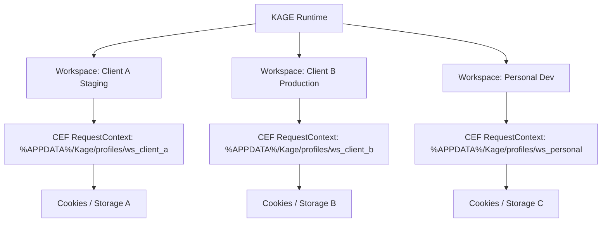

# KAGE Workspace System Specification

| Document Metadata | Details |
|---|---|
| **Document ID** | KAGE-CORE-004 |
| **Status** | Approved Core Specification |
| **Version** | v0.2.1 |
| **Last Updated** | 2026-09-16 |
| **Target Milestone** | v1.0.0 MVP |
| **Classification** | Workspace Isolation & Project Management |

---

## 1. Executive Summary & Product Mission

In consumer browsers, users manage dozens of unrelated tabs mixed together across multiple browser windows, causing context switching fatigue and memory bloat.

In KAGE, the browser organizes work into **Workspaces**. A Workspace is a self-contained developer project environment combining open tabs, organized tab groups, isolated cookies and web storage, developer scratchpad notes, active AI conversation history, and project configuration.

```
╔═════════════════════════════════════════════════════════════════════════════════════╗
║                            PRIME ARCHITECTURAL INVARIANT                            ║
║                                                                                     ║
║        AI NEVER GETS BROWSER AUTHORITY DIRECTLY. EVERY AI ACTION BECOMES            ║
║        A TYPED TOOL BUS REQUEST, AND THE TOOL BUS—NOT THE MODEL, PROMPT,            ║
║        PLUGIN, OR UI—OWNS VALIDATION, AUTHORIZATION, EXECUTION,                     ║
║        CANCELLATION, AND AUDITING.                                                  ║
╚═════════════════════════════════════════════════════════════════════════════════════╝
```

---

## 2. Workspace Domain Model

A Workspace encapsulates the full state of a developer project:

```
Workspace
 ├── Identifier & Metadata (ID, Name, Icon, Color Token, Path)
 ├── Tab Strip State (Open tabs, Tab groups, Pin status, Active tab)
 ├── Storage & Profile Isolation (Dedicated CEF Request Context)
 ├── Permissions (Per-origin permissions granted within this workspace)
 ├── Developer Notes & Scratchpad (Markdown notes, snippets, curl commands)
 ├── Testing Lab Suites (Recorded test sessions associated with project)
 ├── AI Conversation History (Threaded co-pilot discussions & token logs)
 └── Configuration Overrides (Proxy, User-Agent, Headers, Mock rules)
```

### 2.1 Rust Struct Representation

```rust
#[derive(Debug, Clone, Serialize, Deserialize)]
pub struct KageWorkspace {
    pub id: String,                // Unique ULID (e.g. "ws_01J8Y4B8X7...")
    pub name: String,              // e.g. "E-Commerce Checkout Redesign"
    pub icon: String,              // Lucide icon name or emoji
    pub color_token: String,       // Palette token (e.g. "#DA627D")
    pub root_directory: Option<String>, // Associated local git repository path
    pub created_at_ms: u64,
    pub last_accessed_ms: u64,
    pub is_isolated: bool,         // True = dedicated cookie/cache partition
    pub settings: WorkspaceSettings,
}

#[derive(Debug, Clone, Serialize, Deserialize)]
pub struct WorkspaceSettings {
    pub default_search_engine: String,
    pub proxy_url: Option<String>,
    pub custom_headers: HashMap<String, String>,
    pub auto_discard_background_tabs: bool,
}
```

---

## 3. Storage & Profile Isolation Architecture

To prevent cross-tenant credential leakage (e.g. testing two user accounts on staging simultaneously), KAGE provides **Isolated Workspace Contexts**:



- **Isolated Cookies:** Session cookies, JWTs, and authentication headers in Workspace A are completely physically separated on disk from Workspace B.
- **Isolated Cache & Service Workers:** Service workers and IndexedDB caches cannot leak data across workspaces.
- **Shared vs Isolated Mode:** Developers can configure a workspace as "Shared" (shares the default profile with general browsing) or "Isolated" (dedicated sandboxed profile path).

---

## 4. Workspace Persistence & SQLite Backing

All workspace configuration and structural data is persisted in KAGE's local SQLite database (`%APPDATA%/Kage/kage_data.db`):

```sql
CREATE TABLE workspaces (
    id TEXT PRIMARY KEY,
    name TEXT NOT NULL,
    icon TEXT NOT NULL,
    color_token TEXT NOT NULL,
    root_directory TEXT,
    created_at_ms INTEGER NOT NULL,
    last_accessed_ms INTEGER NOT NULL,
    is_isolated INTEGER NOT NULL DEFAULT 1,
    settings_json TEXT NOT NULL
);

CREATE TABLE workspace_tabs (
    id TEXT PRIMARY KEY,
    workspace_id TEXT NOT NULL,
    group_id TEXT,
    title TEXT NOT NULL,
    url TEXT NOT NULL,
    favicon_url TEXT,
    sort_order INTEGER NOT NULL,
    is_pinned INTEGER NOT NULL DEFAULT 0,
    FOREIGN KEY(workspace_id) REFERENCES workspaces(id) ON DELETE CASCADE
);

CREATE TABLE workspace_notes (
    id TEXT PRIMARY KEY,
    workspace_id TEXT NOT NULL,
    title TEXT NOT NULL,
    content_markdown TEXT NOT NULL,
    updated_at_ms INTEGER NOT NULL,
    FOREIGN KEY(workspace_id) REFERENCES workspaces(id) ON DELETE CASCADE
);
```

---

## 5. Workspace Switching & Suspension Mechanics

Switching workspaces takes `< 200 ms` (Benchmark Target) through an atomic suspend-and-restore cycle:

```
User selects Workspace B from Switcher (or Ctrl+1..9)
                    │
                    ▼
1. Persist Active State of Workspace A
   • Save open tab URLs, scroll positions, and active tab ID to SQLite
   • Hide active CEF browser windows (`SW_HIDE`)
                    │
                    ▼
2. Suspend Workspace A Tabs
   • Emit background throttling to active renderers
   • Optionally discard tabs if memory exceeds threshold
                    │
                    ▼
3. Load Workspace B from SQLite
   • Read tab list, tab groups, notes, and profile path
   • Switch active CEF RequestContext to Workspace B
                    │
                    ▼
4. Restore Active Tab
   • Instantiate or unhide CEF browser window for Workspace B active tab
   • Mount React tab strip and update Omnibox
                    │
                    ▼
5. Ready (Emits `workspace:activated { workspace_id }`)
```

---

## 6. Import & Export Pipeline (`.kagews`)

Developers can share workspace configurations with team members or backup project environments:

### 6.1 Export Format (`.kagews` JSON bundle)
```json
{
  "$schema": "https://kage.dev/schemas/workspace-v1.json",
  "version": "1.0",
  "workspace": {
    "name": "E-Commerce Checkout Staging",
    "color_token": "#DA627D",
    "tabs": [
      { "url": "https://staging.store.example.com", "title": "Storefront", "group": "App" },
      { "url": "https://api-staging.example.com/docs", "title": "API Docs", "group": "Backend" }
    ],
    "notes": [
      { "title": "Test Credentials", "content_markdown": "Use test user `qa_buyer@example.com`" }
    ],
    "settings": {
      "custom_headers": { "X-Environment": "staging" }
    }
  }
}
```

> [!CAUTION]
> **Secret Exclusion Rule:** Exporting a workspace **strictly excludes** private cookies, authentication tokens, and local cache files by default. Team members import clean URL sets and configuration without credential leakage.
