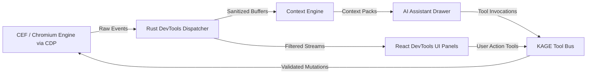

# KAGE DevTools Architecture Specification

| Document Metadata | Details |
|---|---|
| **Document ID** | KAGE-DEV-001 |
| **Status** | Approved Core Specification |
| **Version** | v0.2.1 |
| **Last Updated** | 2026-09-16 |
| **Target Milestone** | v1.0.0 MVP |
| **Classification** | Developer Tooling & Diagnostics Infrastructure |

---

## 1. Executive Summary & Product Mission

In legacy browsers, DevTools is an isolated, docked web application bundled with Chromium that operates in a separate window or iframe, isolated from the browser's own UI and unaware of modern AI or automation workflows.

In KAGE, **DevTools is a first-class, integrated workstation surface**. Built directly into KAGE's Liquid Glass shell in React/TypeScript, the DevTools panels consume real-time telemetry from CEF via the Chrome DevTools Protocol (CDP), share live state with the **Context Engine**, and interact bidirectionally with the **KAGE Tool Bus**.

```
╔═════════════════════════════════════════════════════════════════════════════════════╗
║                            PRIME ARCHITECTURAL INVARIANT                            ║
║                                                                                     ║
║        AI NEVER GETS BROWSER AUTHORITY DIRECTLY. EVERY AI ACTION BECOMES            ║
║        A TYPED TOOL BUS REQUEST, AND THE TOOL BUS—NOT THE MODEL, PROMPT,            ║
║        PLUGIN, OR UI—OWNS VALIDATION, AUTHORIZATION, EXECUTION,                     ║
║        CANCELLATION, AND AUDITING.                                                  ║
╚═════════════════════════════════════════════════════════════════════════════════════╝
```

---

## 2. DevTools Panel Matrix & CDP Domain Ownership

KAGE's developer panels map to authoritative CDP domains managed by the privileged Rust CDP client:

```
┌────────────────────────────────────────────────────────────────────────┐
│                   PANEL & CDP DOMAIN OWNERSHIP MATRIX                  │
├───────────────┬──────────────────────┬─────────────────────────────────┤
│ PANEL         │ CDP DOMAINS          │ PRIMARY RESPONSIBILITIES        │
├───────────────┼──────────────────────┼─────────────────────────────────┤
│ Elements      │ `DOM`, `CSS`,        │ Live DOM tree, computed styles, │
│               │ `Overlay`            │ cascade rules, box model quads. │
├───────────────┼──────────────────────┼─────────────────────────────────┤
│ Console       │ `Console`, `Runtime`,│ JS logs, unhandled exceptions,  │
│               │ `Log`                │ interactive REPL evaluation.    │
├───────────────┼──────────────────────┼─────────────────────────────────┤
│ Network       │ `Network`, `Fetch`   │ HTTP/3 waterfall, headers, HAR, │
│               │                      │ request mocking, bandwidth sim. │
├───────────────┼──────────────────────┼─────────────────────────────────┤
│ Performance   │ `Performance`,       │ Core Web Vitals, FPS counter,   │
│               │ `Tracing`            │ layout shift traces, CPU flame. │
├───────────────┼──────────────────────┼─────────────────────────────────┤
│ Storage       │ `Storage`, `DOMStorage`│ Cookies, LocalStorage, Cache, │
│               │ `IndexedDB`          │ service workers, quota usage.   │
├───────────────┼──────────────────────┼─────────────────────────────────┤
│ Accessibility │ `Accessibility`,     │ Full accessibility tree, ARIA   │
│               │ `DOM`                │ role inspection, contrast check.│
├───────────────┼──────────────────────┼─────────────────────────────────┤
│ Security      │ `Security`, `Network`│ TLS certificate details, Mixed  │
│               │                      │ Content detection, CSP headers. │
├───────────────┼──────────────────────┼─────────────────────────────────┤
│ Responsive    │ `Emulation`, `Page`  │ Device metrics, touch emu,      │
│               │                      │ DPR scaling, media query sim.   │
└───────────────┴──────────────────────┴─────────────────────────────────┘
```

---

## 3. Tripartite Subsystem Integration

DevTools does not exist in a silo. It forms an integrated data loop between the UI panels, the active Context Engine, and the KAGE Tool Bus:



1. **Telemetry Feed:** Raw CDP events stream into the Rust core over loopback WebSocket.
2. **Context Engine Ingestion:** The Context Engine extracts high-priority signals (failed 4xx/5xx requests, console errors, selected DOM node) to build AI Context Packs.
3. **Tool Bus Mutation:** When a developer edits a CSS property in the Elements panel or the AI modifies an attribute, the modification routes through the Tool Bus to guarantee schema validation and audit logging.

---

## 4. Panel Specifications

### 4.1 Elements Panel
- **DOM Tree Virtualization:** Renders large DOM structures (50,000+ nodes) at native 60fps using virtualized list rendering (`react-virtual`).
- **Synchronized Hover & Lock:** Hovering a node in the Elements tree triggers in-viewport highlight via `Overlay.highlightNode`; clicking a node pins it in Micro Inspect.
- **Matched Rules & Cascade View:** Visualizes inherited styles, overridden declarations with strikethrough, and CSS source locations (file and line number).
- **Inline Editing:** Live editing of tag names, attributes, and CSS declarations backed by `modify_dom@1` and `modify_css@1` on the Tool Bus.

### 4.2 Console Panel
- **Multi-Level Filtering:** Instant filtering across `Verbose`, `Info`, `Warning`, and `Error` streams.
- **Intelligent Deduplication:** Identical recurring logs are collapsed with an incremental counter badge (`[x42]`).
- **Interactive REPL:** Provides a hardened JavaScript prompt running via `run_javascript@1` with autocomplete powered by active V8 context introspection.
- **Direct AI Diagnosis:** Every error row includes a `[⚡ Explain with AI]` chip that opens the AI Drawer pre-loaded with the stack trace and relevant source context.

### 4.3 Network Panel
- **Timing Waterfall:** Detailed phase breakdown (DNS Lookup, Initial Connection, TLS Handshake, TTFB, Content Download).
- **Sensitive Data Masking:** In UI view and exports, Bearer tokens and sensitive cookies are automatically masked unless the developer toggles "Reveal Secrets".
- **Throttle Presets:** Direct network emulation via `Network.emulateNetworkConditions` (Fast 3G, Slow 3G, Offline, Custom Latency/Throughput).
- **HAR Export:** Single-click export of complete session traffic to standard `.har` files via native OS file dialogs.

### 4.4 Performance & Core Web Vitals Panel
- **Real-Time HUD:** Ambient monitoring of FCP (First Contentful Paint), LCP (Largest Contentful Paint), CLS (Cumulative Layout Shift), and INP (Interaction to Next Paint).
- **Layout Shift Detection:** Highlights unstable DOM elements responsible for CLS with an orange overlay in the viewport.
- **CPU & Memory Sampling:** Periodic sampling (benchmark target: every 500ms) of JS heap size, layout duration, and compositor frame rate.

### 4.5 Storage Panel
- **Unified Storage Explorer:** Tree navigation for Cookies (per origin), `localStorage`, `sessionStorage`, `IndexedDB`, and Cache Storage.
- **Live Mutation & Deletion:** Direct row editing and deletion of storage keys; operations route through `clear_storage@1` on the Tool Bus.

### 4.6 Accessibility (a11y) Panel
- **Full AxTree Inspector:** Navigates Chromium's internal accessibility tree, displaying computed role, accessible name, and focusability.
- **Contrast Diagnostic:** Highlights elements failing WCAG 2.1 AA (4.5:1 text, 3:1 non-text) with visual viewport callouts.

### 4.7 Security Panel
- **TLS Diagnostics:** Protocol version (TLS 1.3), cipher suite, certificate validity dates, and Certificate Transparency (CT) status.
- **Mixed Content Warnings:** Flags active or passive HTTP resources loaded inside HTTPS contexts.
- **CSP Inspector:** Parses and displays active Content Security Policy directives and flagged violations.

### 4.8 Responsive & Device Emulation
- **Preset Catalog:** Mobile and tablet presets (iPhone, Pixel, iPad) configuring viewport dimensions, device scale factor (DPR), and user agent.
- **Touch Simulation:** Toggles touch event emulation via `Emulation.setTouchEmulationEnabled`.
- **Media Feature Overrides:** Simulates `prefers-color-scheme: dark/light` and `prefers-reduced-motion: reduce`.

---

## 5. Docking & Layout Orchestration

The DevTools workstation supports three distinct docking layouts:

```
┌─────────────────────────────────────────────────────────────┐
│ ✦ DOCK BOTTOM (Default for wide displays)                   │
│  [ CEF Web Viewport (Height: 60%)                         ] │
│  [ DevTools Drawer: Elements | Console | Net (Height: 40%)] │
├─────────────────────────────────────────────────────────────┤
│ ✦ DOCK RIGHT (Default for widescreen monitors)              │
│  [ CEF Web Viewport (Width: 60%) ] [ DevTools (Width: 40%)] │
├─────────────────────────────────────────────────────────────┤
│ ✦ DETACHED WINDOW (Multi-monitor setups)                    │
│  [ Independent native OS window for DevTools workspace   ] │
└─────────────────────────────────────────────────────────────┘
```

When DevTools is resized or docked, Tauri recomputes the CEF viewport bounds and applies atomic native window adjustments via `SetWindowPos` on Windows / `setFrame:` on macOS.
