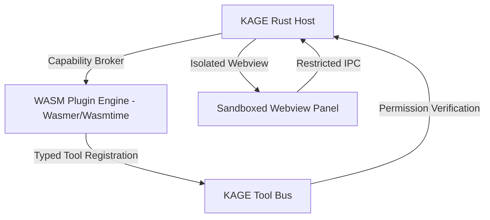

# KAGE Plugin API Specification

| Document Metadata | Details |
|---|---|
| **Document ID** | KAGE-PLAT-002 |
| **Status** | Approved Core Specification |
| **Version** | v0.2.1 |
| **Last Updated** | 2026-09-16 |
| **Target Milestone** | v1.0.0 MVP |
| **Classification** | Extensibility, SDK Architecture & Plugin Sandbox |

---

## 1. Executive Summary & Extensibility Vision

Modern browsers treat extensions as secondary scripts injected into web pages via Manifest V3, severely restricting access to native OS capabilities, developer panels, and AI co-pilots.

The **KAGE Plugin API** treats the browser as a programmable developer workstation. Plugins can register custom developer panels, add new tools to the **KAGE Tool Bus**, introduce specialized Micro Inspect actions (e.g. *"Export to Tailwind Component"*), and extend AI agent capabilities—while running inside a secure, capability-sandboxed runtime.

```
╔═════════════════════════════════════════════════════════════════════════════════════╗
║                            PRIME ARCHITECTURAL INVARIANT                            ║
║                                                                                     ║
║        AI NEVER GETS BROWSER AUTHORITY DIRECTLY. EVERY AI ACTION BECOMES            ║
║        A TYPED TOOL BUS REQUEST, AND THE TOOL BUS—NOT THE MODEL, PROMPT,            ║
║        PLUGIN, OR UI—OWNS VALIDATION, AUTHORIZATION, EXECUTION,                     ║
║        CANCELLATION, AND AUDITING.                                                  ║
╚═════════════════════════════════════════════════════════════════════════════════════╝
```

---

## 2. Plugin Extension Points

A KAGE plugin can hook into six distinct extension surfaces:

```
Plugin Package
 ├── Custom Tools (Registers new versioned tools on the KAGE Tool Bus)
 ├── Custom Panels (Renders React/Webview panels in the DevTools dock)
 ├── Micro Inspect Actions (Adds custom buttons to the floating inspector card)
 ├── Omnibox Commands (Registers custom prefixes like `gh:`, `jira:`)
 ├── Context Engine Analyzers (Provides custom parsers for domain-specific payloads)
 └── AI Skills & Prompts (Supplies system instructions & specialized workflows)
```

---

## 3. Plugin Manifest (`kage-plugin.json`)

Every plugin contains a root manifest declaring its identity, capabilities, and requested permissions:

```json
{
  "$schema": "https://kage.dev/schemas/plugin-v1.json",
  "name": "tailwind-component-extractor",
  "version": "1.0.0",
  "display_name": "Tailwind Component Extractor",
  "description": "Exports inspected DOM elements directly into clean Tailwind CSS JSX components.",
  "author": "Kage Community",
  "main": "dist/index.wasm",
  "capabilities": {
    "tools": [
      {
        "name": "extract_tailwind_jsx",
        "description": "Converts DOM computed styles into Tailwind classes",
        "permission_tier": 0
      }
    ],
    "inspect_actions": [
      {
        "id": "action_tailwind_export",
        "label": "Export Tailwind JSX",
        "icon": "code",
        "tool": "extract_tailwind_jsx"
      }
    ],
    "panels": [
      {
        "id": "panel_tailwind_preview",
        "title": "Tailwind Preview",
        "icon": "palette",
        "entry": "dist/panel.html"
      }
    ]
  },
  "permissions": [
    "tool_bus:register",
    "inspect:read",
    "clipboard:write"
  ]
}
```

---

## 4. Sandbox Boundary & Execution Model

KAGE enforces a **Dual Sandbox Architecture** to ensure third-party plugins cannot compromise host stability or exfiltrate private credentials:



1. **Backend Logic in WebAssembly (WASM):**
   - Plugin backend code compiles to WebAssembly (`wasm32-wasi`).
   - Runs in a memory-isolated sandbox via `wasmtime`.
   - Has **zero direct access** to the host filesystem, sockets, or environment variables. All host interactions route through strict WASI capability imports brokered by Rust.
2. **UI Panels in Sandboxed Webviews:**
   - Plugin UI panels execute in an isolated webview with a strict Content Security Policy.
   - Panels communicate with the plugin backend exclusively through typed IPC messages.

### 4.1 Plugin Security & Capability Validation Gate

> [!WARNING]
> **Implementation Security Requirement:** The WASM sandbox boundary cannot be treated as proven merely because it uses Wasmtime/WASI. Before third-party plugin execution is enabled in production, the runtime must pass a dedicated **Plugin Security & Capability Test Suite** covering:
> 1. **Sandbox Escape Attempts:** Memory boundary violation tests, attempted host function probing, and WASI import tampering.
> 2. **Resource Exhaustion (DoS):** Infinite CPU loops (enforcing fuel/epoch-based preemption in Wasmtime), unbounded linear memory allocations (enforcing strict 64MB ceilings), and stack overflow attempts.
> 3. **Malicious Manifests:** Spoofed tool names colliding with core tools (e.g. attempting to override `inspect_dom@1`), malformed JSON schemas, and unauthorized permission escalation requests.
> 4. **Panel IPC Abuse:** Malicious HTML in sandboxed webviews attempting postMessage fuzzing, CSRF, or cross-panel DOM manipulation.
> 5. **Permission Escalation:** Prohibiting a Tier 0 plugin tool from transitively calling Tier 3 host capabilities without independent user confirmation.

---

## 5. Registering Custom Tools on the Tool Bus

Plugins can expose custom tools that become instantly accessible to both developers and the AI Agent:

```rust
// Plugin WASM Export Contract
#[no_mangle]
pub extern "C" fn kage_plugin_init() -> *mut PluginRegistration {
    let mut reg = PluginRegistration::new("tailwind_extractor", "1.0.0");
    
    reg.register_tool(ToolDefinition {
        name: "extract_tailwind_jsx@1",
        description: "Translates element computed styles into Tailwind utility classes.",
        schema_json: r#"{"type": "object", "properties": {"node_id": {"type": "integer"}}}"#,
        base_tier: PermissionTier::Tier0ReadOnly,
        handler: handle_tailwind_extraction,
    });

    reg.into_raw()
}
```

When the AI model or user invokes `extract_tailwind_jsx@1`:
- The Tool Bus validates input parameters against the schema.
- The Tool Bus verifies permissions.
- The invocation is dispatched into the plugin's WASM linear memory.
- The execution is logged in the append-only SQLite audit database.

---

## 6. Plugin Lifecycle & State Management

```
┌─────────────────────────────────────────────────────────────┐
│                      PLUGIN LIFECYCLE                       │
├─────────────┬───────────────────────────────────────────────┤
│ Install     │ Downloads package, validates cryptographical  │
│             │ signature, parses manifest, creates SQLite rec│
├─────────────┼───────────────────────────────────────────────┤
│ Enable      │ Instantiates WASM runtime, registers tools,   │
│             │ mounts UI panel tabs in DevTools dock         │
├─────────────┼───────────────────────────────────────────────┤
│ Execute     │ Processes requests with 5,000ms hard timeout  │
│             │ and bounded memory ceiling (default: 64MB)    │
├─────────────┼───────────────────────────────────────────────┤
│ Disable     │ Deregisters tools from Tool Bus, unmounts     │
│             │ panels, tears down WASM instance              │
├─────────────┼───────────────────────────────────────────────┤
│ Uninstall   │ Deletes package from disk, cleans SQLite state│
└─────────────┴───────────────────────────────────────────────┘
```

---

## 7. Version Compatibility & Deprecation

To maintain long-term ecosystem stability:
- Plugins target a specific KAGE SDK API version (e.g. `kage_api_version: "1.0"`).
- The KAGE host guarantees backward compatibility for all minor API versions.
- If a plugin requires an incompatible API change, KAGE refuses to load the plugin and displays an actionable upgrade prompt in Developer Settings.
