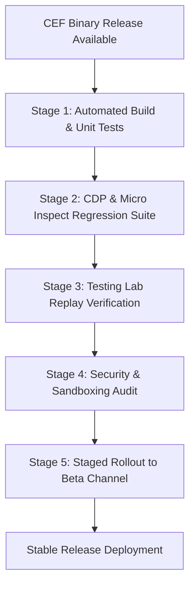

# KAGE Release Strategy Specification

| Document Metadata | Details |
|---|---|
| **Document ID** | KAGE-REL-001 |
| **Status** | Approved Core Specification |
| **Version** | v0.2.1 |
| **Last Updated** | 2026-09-16 |
| **Target Milestone** | v1.0.0 MVP |
| **Classification** | Release Engineering, Cadence & Upstream Tracking |

---

## 1. Executive Summary & Release Philosophy

As a browser built on the Chromium Embedded Framework (CEF), KAGE's release strategy must solve a fundamental engineering tension:
1. **Upstream Security Alignment:** Chromium frequently patches high-severity zero-day vulnerabilities (e.g. V8 type confusions, Blink heap overflows) that require rapid deployment.
2. **Developer Workstation Stability:** Developers rely on KAGE for continuous work. Automated updates must never corrupt SQLite workspaces, break recorded tests, or degrade performance.

```
╔═════════════════════════════════════════════════════════════════════════════════════╗
║                            PRIME ARCHITECTURAL INVARIANT                            ║
║                                                                                     ║
║        AI NEVER GETS BROWSER AUTHORITY DIRECTLY. EVERY AI ACTION BECOMES            ║
║        A TYPED TOOL BUS REQUEST, AND THE TOOL BUS—NOT THE MODEL, PROMPT,            ║
║        PLUGIN, OR UI—OWNS VALIDATION, AUTHORIZATION, EXECUTION,                     ║
║        CANCELLATION, AND AUDITING.                                                  ║
╚═════════════════════════════════════════════════════════════════════════════════════╝
```

---

## 2. Upstream Tracking & Release Cadence

Chromium releases a major milestone every 4 weeks. To maintain velocity without introducing instability, KAGE operates on a dual-cadence model:

```
┌────────────────────────────────────────────────────────┐
│               KAGE RELEASE TRACKING CADENCE            │
├────────────────────┬───────────────────┬───────────────┤
│ EVENT TYPE         │ UPSTREAM TRIGGER  │ KAGE CADENCE  │
├────────────────────┼───────────────────┼───────────────┤
│ Standard Milestone │ Major Chromium    │ Every 8–12 wks│
│ Upgrade            │ Release (CEF)     │ (Every 2-3 M) │
├────────────────────┼───────────────────┼───────────────┤
│ Critical Security  │ High/Critical CVE │ Within 48–72h │
│ Hotfix             │ in Blink/V8       │ Out-of-band   │
├────────────────────┼───────────────────┼───────────────┤
│ KAGE Feature Patch │ Internal Sprint / │ Bi-weekly     │
│ (UI/AI/Tools)      │ Bug fixes         │               │
└────────────────────┴───────────────────┴───────────────┘
```

### 2.1 Critical Security Advisory Protocol
When an active zero-day exploit is disclosed in upstream Chromium:
1. **Compatibility Assessment:** The engineering lead assesses whether the upstream fix alters CEF C-APIs or CDP behaviors used by KAGE.
2. **Binary Bump:** The pinned version in `cef_version.json` is updated to the upstream patched build.
3. **Automated CI Regression Run:** Full test suite executes across Windows, macOS, and Linux.
4. **Out-of-Band Hotfix Release:** Deployed via high-priority auto-updater channel within 72 hours.

---

## 3. Release Lifecycle & Quality Gates

Every KAGE release candidate (RC) must successfully pass five sequential validation stages:



1. **Stage 1 (Unit Verification):** Rust Tool Bus, schema validators, and React design tokens pass 100% automated tests.
2. **Stage 2 (CDP & Micro Inspect Regression):** Verifies that Chromium DOM/CSS changes have not broken element highlighting, coordinate conversion, or box model calculation.
3. **Stage 3 (Testing Lab Replay):** Executes a golden test suite of 50 recorded web flows (e.g. GitHub, Stripe Checkout, Jira) to confirm replay determinism.
4. **Stage 4 (Security Audit):** Validates that CDP loopback port restrictions, prompt-injection framing, and SQLite secret redactions remain intact.
5. **Stage 5 (Staged Rollout):** Deployed first to internal team (Dogfood), then to Beta channel users for 7 days before broad Stable deployment.

---

## 4. Release Channels

| Channel | Target Audience | Update Frequency | Purpose |
|---|---|---|---|
| **Nightly / Dev** | Core contributors & early testers | Daily (Automated CI builds) | Validates cutting-edge UI features and experimental tools. |
| **Beta** | Developer community early adopters | Bi-weekly | Pre-release validation of major CEF upgrades and new plugin APIs. |
| **Stable** | General developer audience | 8–12 weeks (plus security hotfixes) | Rock-solid, production-grade workstation. |

---

## 5. Auto-Update Pipeline & Cryptographic Signing

KAGE integrates Tauri's native auto-update framework backed by public-key cryptography:

```
┌─────────────────────────────────────────────────────────────┐
│ Tauri Updater Client                                        │
│                                                             │
│  1. Check endpoint: https://updates.kage.dev/api/v1/update  │
│  2. Download cryptographic signature (.sig)                 │
│  3. Verify payload against pinned Ed25519 Public Key        │
│  4. Stage download in background without interrupting work │
│  5. Prompt user: "Relaunch to complete update"              │
└─────────────────────────────────────────────────────────────┘
```

- **Signature Algorithm:** Minisign / Ed25519 public key verification prevents Man-in-the-Middle update tampering.
- **Atomic Swap:** The update binary is unpacked to a temporary folder and swapped atomically upon application restart.
- **Rollback Protection:** If an update fails to launch, the supervisor restores the previous executable version.

---

## 6. Versioning Semantics & Schema Compatibility

KAGE follows Semantic Versioning (SemVer 2.0.0) with explicit Chromium alignment:

$$\text{Format: } \mathbf{\text{vMAJOR.MINOR.PATCH}} \text{ (Chromium CHROMIUM\_VERSION)}$$
$$\text{Example: } \mathbf{\text{v1.2.0}} \text{ (Chromium 128.0.6613.120)}$$

### 6.1 Database Schema Migrations on Update
When an update introduces changes to `kage_data.db`:
- Rust core detects that `schema_migrations.version < TARGET_VERSION`.
- An automated pre-migration backup is written to `%APPDATA%/Kage/backups/pre-update-<version>.db`.
- SQLite schema migrations execute sequentially inside a single ACID transaction.
- If any migration fails, the transaction rolls back, restores the backup, and displays an actionable diagnostic error.
