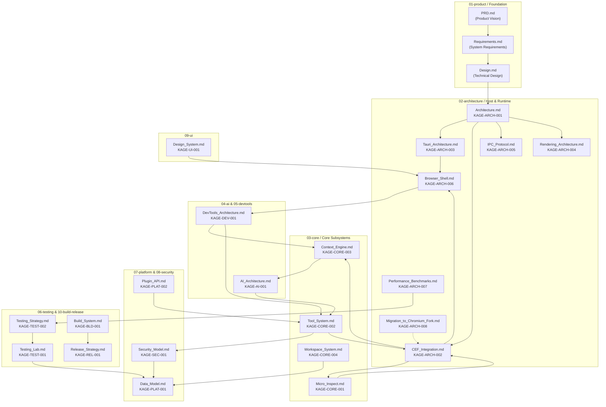

# KAGE Specification Suite & Architecture Map

**Status:** Approved v0.2.1 · **Total Specifications:** 25 Documents · **Target:** v1.0.0 MVP

Welcome to the KAGE technical documentation suite. KAGE is a developer-first standalone browser built on **Tauri (Rust) + Chromium Embedded Framework (CEF) + React/TypeScript (Liquid Glass UI Chrome)**.

---

## 1. System Interconnection Topology

Every document in this suite is connected through the **Prime Architectural Invariant**:
> *"AI never gets browser authority directly. Every AI action becomes a typed Tool Bus request, and the Tool Bus—not the model, prompt, plugin, or UI—owns validation, authorization, execution, cancellation, and auditing."*

---

## 2. Complete Specification Directory

### 01 · Product Definition
| Document | Document ID | Description |
|---|---|---|
| [PRD.md](01-product/PRD.md) | `KAGE-PRD` | High-level product vision, developer persona, core value proposition, and success metrics. |
| [Requirements.md](01-product/Requirements.md) | `KAGE-REQ` | 74 actionable requirements spanning browser engine, DevTools, AI agent, testing, and UI. |
| [Design.md](Design.md) | `KAGE-DES` | High-level technical architecture, tech stack evaluation, and architectural principles. |

### 02 · System Architecture & Host Runtime
| Document | Document ID | Description |
|---|---|---|
| [Architecture.md](02-architecture/Architecture.md) | `KAGE-ARCH-001` | Global system topology, 4-tier execution domains, thread models, and subsystem lifecycle. |
| [CEF_Integration.md](02-architecture/CEF_Integration.md) | `KAGE-ARCH-002` | Chromium Embedded Framework embedding, C-API/Rust FFI bindings, message pump, and OSR. |
| [Tauri_Architecture.md](02-architecture/Tauri_Architecture.md) | `KAGE-ARCH-003` | Host process, custom plugins, native OS windowing, event buses, and asynchronous task runners. |
| [Rendering_Architecture.md](02-architecture/Rendering_Architecture.md) | `KAGE-ARCH-004` | Off-screen rendering (OSR), GPU surface sharing, DirectX/Metal/Vulkan compositor, and 120 FPS target. |
| [IPC_Protocol.md](02-architecture/IPC_Protocol.md) | `KAGE-ARCH-005` | Typed JSON/binary IPC contracts between Rust host, React UI Chrome, and CEF renderers. |
| [Browser_Shell.md](02-architecture/Browser_Shell.md) | `KAGE-ARCH-006` | Native browser shell, tab strip lifecycle, omnibox command routing, window chrome, and crash recovery. |
| [Performance_Benchmarks.md](02-architecture/Performance_Benchmarks.md) | `KAGE-ARCH-007` | Quantitative budgets: <150MB baseline RAM, <16ms frame times, <100ms tool execution. |
| [Migration_to_Chromium_Fork.md](02-architecture/Migration_to_Chromium_Fork.md) | `KAGE-ARCH-008` | Long-term upgrade path from CEF library embedding to full custom Chromium source fork. |

### 03 · Core Subsystems
| Document | Document ID | Description |
|---|---|---|
| [Micro_Inspect.md](03-core/Micro_Inspect.md) | `KAGE-CORE-001` | Hover-to-inspect DOM/CSS overlay, pinpoint target resolution, and instant context generation. |
| [Tool_System.md](03-core/Tool_System.md) | `KAGE-CORE-002` | Unified Rust Tool Bus, type contracts, execution engine, cancellation tokens, and audit trails. |
| [Context_Engine.md](03-core/Context_Engine.md) | `KAGE-CORE-003` | DOM/Network/Console context compression, secret token sanitization, and LLM budget packing. |
| [Workspace_System.md](03-core/Workspace_System.md) | `KAGE-CORE-004` | Project workspaces, saved tab groups, layout presets, local SQLite persistence, and state restore. |

### 04 · Artificial Intelligence
| Document | Document ID | Description |
|---|---|---|
| [AI_Architecture.md](04-ai/AI_Architecture.md) | `KAGE-AI-001` | Multi-provider LLM routing, bounded autonomous agent loop (max 10 steps), and Tool Bus governance. |

### 05 · Developer Tools
| Document | Document ID | Description |
|---|---|---|
| [DevTools_Architecture.md](05-devtools/DevTools_Architecture.md) | `KAGE-DEV-001` | Native React DevTools panels: Elements, Console, Network, Storage, CDP domain multiplexing. |

### 06 · Testing & Quality Assurance
| Document | Document ID | Description |
|---|---|---|
| [Testing_Lab.md](06-testing/Testing_Lab.md) | `KAGE-TEST-001` | Native action recorder, assertion builder, headless replay runner, and diffable test artifacts. |
| [Testing_Strategy.md](06-testing/Testing_Strategy.md) | `KAGE-TEST-002` | Quality gates, unit test suites, integration test harness, end-to-end testing, and chaos testing. |

### 07 · Platform & Storage
| Document | Document ID | Description |
|---|---|---|
| [Data_Model.md](07-platform/Data_Model.md) | `KAGE-PLAT-001` | SQLite schema (`kage_data.db` & `security_audit.db`), migrations, entities, and query patterns. |
| [Plugin_API.md](07-platform/Plugin_API.md) | `KAGE-PLAT-002` | Extensibility runtime, WebAssembly (Wasmtime) sandboxing, capability manifests, and plugin hooks. |

### 08 · Security & Permissions
| Document | Document ID | Description |
|---|---|---|
| [Security_Model.md](08-security/Security_Model.md) | `KAGE-SEC-001` | Threat model, untrusted webpage boundaries, 4-tier permission policy engine, and immutable audit logging. |

### 09 · User Interface & Styling
| Document | Document ID | Description |
|---|---|---|
| [Design_System.md](09-ui/Design_System.md) | `KAGE-UI-001` | Liquid Glass design language, anime-futuristic peach/burgundy palette, typography, and motion tokens. |

### 10 · Build, Release & Operations
| Document | Document ID | Description |
|---|---|---|
| [Build_System.md](10-build-release/Build_System.md) | `KAGE-BLD-001` | Cargo + Vite build pipeline, CEF binary distribution caching, multi-platform artifact packaging. |
| [Release_Strategy.md](10-build-release/Release_Strategy.md) | `KAGE-REL-001` | Semantic versioning, release channels (Canary, Dev, Beta, Stable), automated CI/CD, and rollback procedures. |

---

## 3. Subsystem Cross-Reference Matrix

How the primary subsystems interact with one another:

| Subsystem | Relies On | Feeds Into | Enforced By |
|---|---|---|---|
| **AI Agent** (`04-ai`) | `Context_Engine`, `Tool_System` | User Chat, DevTools Panels | `Security_Model` Tier 1-4 |
| **Context Engine** (`03-core`) | `CEF_Integration` (CDP), `DevTools` | `AI_Architecture` (Prompt Pack) | Secret Token Sanitizer |
| **Tool Bus** (`03-core`) | `Tauri_Architecture`, `CEF_Integration` | Browser DOM, Network, FS | `Security_Model`, `Data_Model` (Audit) |
| **Browser Shell** (`02-architecture`) | `Tauri_Architecture`, `CEF_Integration` | `Design_System`, `Workspace_System` | Window Lifecycle Manager |
| **DevTools** (`05-devtools`) | `CEF_Integration` (CDP), `IPC_Protocol` | `Context_Engine`, `Testing_Lab` | CDP Multiplexer |
| **Testing Lab** (`06-testing`) | `Tool_System`, `CEF_Integration` (CDP) | Test Runner, `Data_Model` | Headless Replay Engine |
| **Plugins** (`07-platform`) | `Tool_System`, `IPC_Protocol` | Custom Panels, Extended Tools | Wasm Sandbox & Capability Manifest |
